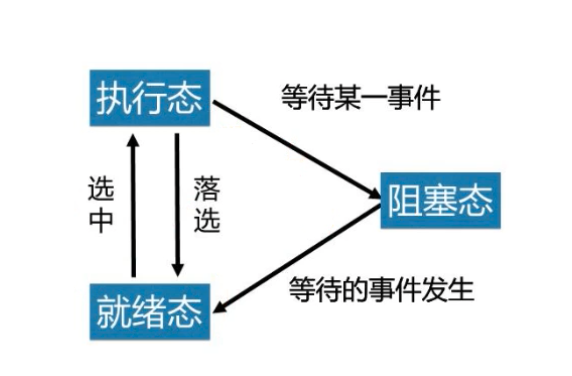
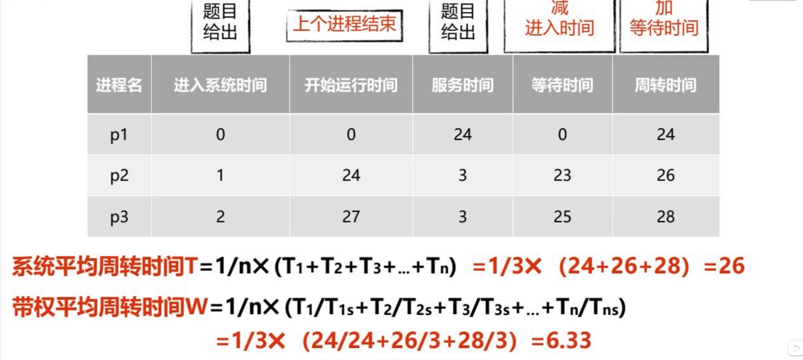
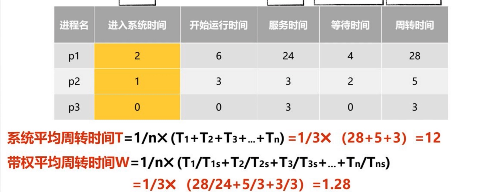
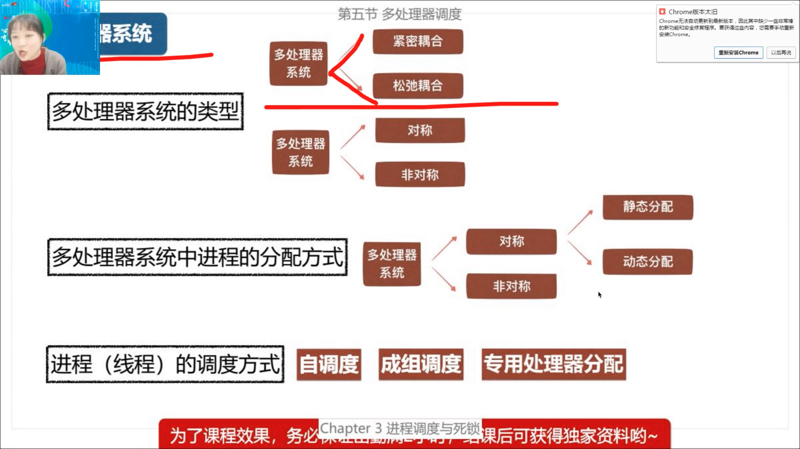

#  计算机操作系统概论

# 第一章 操作系统简介

## 第一节 什么是操作系统

操作系统（operating system OS）是一种复杂的**系统软件**， 是不同**程序代码， 数据结构，数据初始化文件**的结合，可执行

操作系统提供计算机用户与计算机硬件之间的接口，并管理计算机软件和硬件资源


### 一 用户与硬件之间的接口

1. 操作系统与硬件部分相互作用， 
2. 为运行在计算机上的应用程序提供执行环境


### 二 资源管理者

1. 处理机管理
   1. 任意时刻，处理机都只能执行一个程序流， 因此必须由操作系统的处理机调度程序来管理处理机的分配
2. 内存管理
   1. 给程序分配内存空间
3. 设备管理
   1. 完成怎么分配设备，分配那台设备，怎么和设备连接等
4. 文件管理
   1. 为每个文件分配空间，建立目录，对目录进行组织管理以及根据用户请求从外存读取或将数据写入外存


## 第二节 操作系统的发展

### 单道批处理系统

单道批处理系统**内存中只有一道作业**

特点

- 自动性， 不需要人工干预
- 顺序性，一次一个，所以是顺序的
- 单道性

优点

- 减少了等待人工的时间

缺点

- CPU资源不能得到充分的利用


### 多道批处理系统

*内存中可以驻留多道程序*

由操作系统的**作业调度程序按照一定策略**从后备作业队列中**选择若干个作业调入内存**，使他们共享CPU和系统中的各种资源

特点

- 多道性
  - 内存中可以驻留躲到程序
- 无序性
  - 作业1先进入内存，但是可能作业2先完成
- 调度性
- 复杂性
  - 功能和实现技术都比单道批处理系统复杂的多


优点

- 能够提高CPU，内存和IO设备的利用率和系统测吞吐量

缺点

- 系统平均周转时间长


### 分时操作系统

允许多个用户通过终端机同时使用计算机，每个用户通过终端与主机交互时都能得到很快的相应。

特点

- 多路性
  - 允许一台主机上同时连接多台联机终端
- 独立性
  - 各终端彼此独立操作，互不干扰
- 及时性
  - 用户请求能在很短时间内获得响应
- 交互性
  - 用户可以通过终端与系统进行广泛的人机对话


### 实时操作系统

 实时系统必须**及时响应**及时响应外部事件的请求，在**规定时间内完成**对改事件的处理，主要用于**实时控制**和**实时信息处理**领域

特点

- 多路性
  - 允许一台主机上同时连接多台联机终端
- 独立性
  - 各终端用户彼此独立操作，互不干扰
- 及时性
  - 用户请求能在规定时间内得到处理
- 交互性
  - 用户可以通过终端与系统进行人机对话
- 可靠性
  - 由于应用领域的特殊性，对可靠性要求很高


### 操作系统产品现状

| 操作系统       | 运行主体               | 实例                   |
| -------------- | ---------------------- | ---------------------- |
| 主机操作系统   | 大型主机               | IBM的OS/360, OS/390    |
| 服务器操作系统 | 网络服务器             | Linux ，Windows Server |
| 微机操作系统   | 微型计算机（个人PC机） | Windows 7， Mac OS     |
| 嵌入式操作系统 | 嵌入式设备             | Android， IOS          |


## 第三节 操作系统的特征

现代的操作系统都支持多任务，具有并发， 共享， 虚拟化，和异步的特征

- 并发
  - 并发是指两个或多个时间在同一个时间段内发生，并发强调的是“同一时间间隔内”
- 共享
  - 共享是指系统中的资源可供内存中多个并发执行的进程共同使用，资源共享有两种方式，即互斥共享和同时共享
- 虚拟
  - 虚拟是指通过某种技术吧一个物理实体变成若干个逻辑上的对应物，物理实体是真实存在的，而虚拟仅仅是用户感觉到的
- 异步性
  - 进程可以以不可预知的速度向前推进


## 第四节 操作系统的功能

### 管理计算机资源

#### 内存管理

内存管理的主要任务是为多道程序的运行提供良好的环境，方便用户使用内存，**提高内存的利用率**，以及从逻辑上扩充内存一实现虚拟存储

- 内存分配
  - 主要任务是为每道程序分配内存空间，使他们各得其所，提高内存的利用率，以减少不可用的内存空间
  - 操作系统可以通过两种方式分配内存
    - 静态分配
      - 把内存划分成固定大小和数量一定的区域，在系统运行过程中各分区的大小和数量不在变化
    - 动态分配
      - 在系统正在运行中，根据进程的请求分配内存，内存中分区的大小和数量是动态变化的
  - 为了实现内存分配，需要以下数据结构支持和功能支持
    - 用户内存分配数据结构，用来记录内存的使用情况
    - 内存分配功能， 系统按照一定的内存分配算法分配内存空间
    - 内存回收算法，系统需要回收被释放的内存空间
- 内存保护
  - 主要任务
    - 使操作系统内核的空间不会被用户随意访问，以保证系统的安全和稳定
    - 确保每道程序都在自己的内存空间中运行，互不干扰
    - 实现上述两个问题的方案（现代操作一同实现内存保护的方式还有其他方案）
      - 采用界限寄存器存放程序允许访问的地址区间的上限和下限值
      - 程序运行期间访问内存时，吧访问的地址和界限寄存器的值比较，如果发生越界，便发出越界终端请求，已停止该程序的运行
- 地址映射
  - CPU执行程序中访问内存时，需要把程序的逻辑地址转变成物理地址，这个转换的过程就称为地址映射
  - 逻辑地址与物理地址
  - 地址映射
- 内存扩充
  - 借助虚拟技术，从逻辑上扩充内存容量，使系统能够向用户提供比物理内存大的存储容量
    - 请求调入
      - 允许系统在装入一部分用户程序时就启动该程序运行，在程序运行过程中，若发现要执行的指令或访问的数据尚未装入内存，通过请求调入将需要的指令或数据装入内存
    - 置换功能
      - 请求调入时，若发现内存空间不足，需要先将内存中的一部分内容换到外存中，以便腾出内存空间装入当前需要的内容


#### 进程管理

进程管理的主要功能包括进程的描述与组织，进程控制，进程同步，进程通信以及进程调度 


#### 设备管理

设备管理主要完成用户的I/O请求，为用户分配I/O设备，为了完成这些任务，设备管理应该具备以下功能

- 缓冲管理，管理各种缓冲区
- 设备分配，分配用户I/O所需要的设备
- 设备处理，由设备驱动程序来实现CPU与设备控制器之间的通信
- 设备独立性和虚拟设备，独立性是指应用程序独立于物理设备


#### 文件管理

- 文件存储空间管理
  - 为每个文件分配必要的外存空间，提高外存的利用率，并能有助于提高访问文件的速度
- 目录管理
  - 为每个文件建立目录并对众多的目录项进行有效阻止，目录包括文件名，文件属性及文件的地址等信息
- 文件的读写管理和存取控制
  - 根据用户的请求，从外存中读取数据会将数据写入外存，防止未经核准的用户存取文件， 防止冒名顶替存取文件，防止以不正确的方式使用文件


### 提供用户接口

#### 命令接口

  为了便于用户与计算机系统的交互，早起的操作系统都向用户提供了命令接口，命令接口有可分为联机用户接口和脱机用户接口

- 联机用户接口
  - 由一组键盘操作命令和命令解释程序组成
- 脱机用户接口
  - 为批处理作业用户提供的，也称为批处理用户接口

#### 图形用户接口

20世纪90年代，在操作系统中开始引入图形化用户接口


#### 程序接口

操作系统提供给程序员的接口是系统调用


## 第五节 操作系统的体系结构

### 简单的监控程序模型(Windows-NT)

<font color=red>功能简陋</font>，任意时刻系统中只能运行一个任务，保证了对系统信息的互斥访问，保护了数据的安全

### 单体结构模型(MS-DOS Linux, Unix)

<font color=red>所有的软件和数据结构都放置在一个逻辑块中</font>，对外层的用户程序提供一个完整的内核界面 -- 系统调用

### 层次结构模型

基本思想是<font color=red>将操作系统分解为多个小的，容易理解的层</font>，系统功能被隔离在不同层中。

### 客户/服务器模型与为内核结构

核心思想是核心功能外移，即把传统操作系统内核中的一些组成部分放到内核之外作为一个<font color=red>独立的服务器</font>进程来实现

### 动态可扩展结构模型

基本思想就是在运行过程中，能够<font color=red>动态实现</font>系统行为扩展的结构，也可称之为弹性结构


## 第六节 指令的执行

<font color=red>程序时指令的集合</font>，程序的执行就是按照某种控制流程执行指令的过程

一个<font color=red>单一的指令</font>需要的处理称为<font color=red>指令周期</font>

程序计数器（PC）保存有下一次要取的指令地址

取到的指令被放置在处理器的指令寄存器（IR）中


一个指令周期可以划分为两个步骤，分别为

- 取指周期
  - 每个指令周期开始时，处理器从存储器中取出一条指令，在典型的固定长度指令处理器中，程序计数器(PC)保存有下一次要获取指令的地址。除非接收到别的指令，否则处理器在每次完成取指令操作后总是对**程序计数器**（PC）递增，使他能够按顺序取得下一条指令，即位于下一个高端存储器地址的指令
- 执行周期 
  - 取到的指令被放置在处理器的**指令寄存器**（IR）中，指令中包含确定处理器将要采取动作的位，处理器解释指令冰执行要求的动作，这些动作可分为四类
    - 处理器与存储器之间指令或数据传送的操作
    - 处理区与IO设备之间的
    - 算数运算或逻辑运算
    - 控制操作，即修改指令的执行顺序的操作

# 第二章 进程管理

## 第一节 进程的描述

### 一 程序的并发执行

#### 1 程序的顺序执行

早起的无操作系统及单道批处理系统中，程序的执行方式都是典型的顺序执行。

先进入内存的程序先执行，在一个程序执行完成之前不能执行其他程序。

程序顺序执行有以下特点

- 顺序性
  - 处理机的操作，严格按照程序所规定的顺序执行，即只有前一个操作结束后，才能执行后续操作。
- 封闭性
  - 程序是在封闭的环境下执行的，即程序在运行时独占全机资源, 因此各资源的状态只有本程序才能改变，程序一旦开始执行，其结果不受外界因素的影响。
- 可再现性
  - 只要程序执行时的环境和初始条件相同，当程序多次重复执行时，其结果相同。


#### 2 程序的并发执行

并发程序是指在同一时间间隔内运行多个程序，一个程序执行结束前，可以运行其他程序

宏观并行：用户看到多个程序同时向前推进

微观串行：任意时刻一个CPU上只有一个程序在执行

程序并发执行有以下特点

- 间断性
  - 资源的有限使并发执行的程序呈现执行过程是间断性的
- 失去封闭性
  - 程序在并发执行时，系统的状态不再只对正在执行的程序可见
- 不可再现性
  - 同一个程序在输入相同的情况下多次运行，可能出现不同的结果


### 二 进程的概念

#### 1 进程的定义

<font color=red>进程是允许并发执行的程序在某个数据集合上的运行过程</font>

进程是由正文段，用户数据段，进程控制块共同组成的执行环境，

 

正文段存放被执行的机器指令

用户数据段存放进程在执行时直接进行操作的用户数据

进程控制块存放程序的运行环境，操作系统通过这些数据描述和管理进程。


#### 2 进程的特征

进程是操作系统管理的实体，对应了程序的执行过程，具有以下几个特征

- 并发性
  - 多个进程实体能在一段时间间隔内同时运行。*并发是进程和现代操作系统的重要特征*
- 动态性
  - 进程是进程实体的执行过程。进程在被创建后还有进程状态的变化
- 独立性
  - 在没有引入线程概念的操作系统中，进程是独立运行和资源调度的基本单位
- 异步性
  - 是指程序的执行时断时续，进程什么时候执行，什么时候暂停都无法预知，呈现一种随机的特征。在中断技术出现以后，系统还需要处理随时可能出现的中断事件。
- 结构特征
  - 进程实体包括用户正文段，数据段，进程控制块


#### 3 与程序的比较

- 进程与程序的区别
  - 程序时静态的，进程是动态的
  - 程序时存储在某种介质上的二进制代码，进程对应了程序执行的过程。
  - 程序时永久的，进程是暂时的存在
  - 程序是指令的集合，而进程包括了正文段，用户数据段，进程控制块
- 进程与程序的联系
  - 进程是程序的一次执行，进程总是对应至少一个特定的程序
  - 一个程序可以对应多个进程
  - 同一个程序可以在不同的数据集合上运行，构成不同的进程


### 三 进程控制块（PCB）

#### 1 什么是进程控制块

<font color=gree>进程控制块</font>是进程实体的一部分，是操作系统中最重要的数据结构


#### 2 进程控制块中的信息

进程控制块中记录了操作系统所需要的，用于描述进程及控制进程运行所需要的全部信息

- 进程标识符信息
  - 用于唯一标识一个进程。进程控制块中除了存有本进程的标识符外，还存放其父进程，子进程的标识符
- 处理机状态信息
  - 通用寄存器
    - 用户程序可以访问的寄存器，用于暂存信息
  - 指令计数器
    - 其中存放了CPU要访问的下一条指令的地址
  - 程序状态PSW
    - 包括状态信息，如条件码，执行方式和中断屏蔽标志等
  - 用户栈指针
    - 每个用户进程都有一个与之相关的系统栈，用于存放过程和系统调用参数及调用地址，栈指针指向该栈的栈顶
- 进程调度信息
  - 包括进程状态信息，进程优先级和进程调度所需要的其他信息
- 进程控制信息
  - 包括程序和数据的地址，进程同步和通信机制，资源清单，以及连接指针


### 四 进程的状态

进程控制块的状态字段描述了进程当前所处的状态，他有一组标志组成，其中每一种标志描述一种可能的进程状态，Linux中新城状态字段是task_struct中的status字段

#### 1 进程的3中基本状态

- 就绪态
  - 进程一旦获得CPU就可以投入运行的状态，在多任务系统中，可以有多个处于就绪的状态，这些进程被组织成一个或多个就绪进程队列
- 执行态
  - 进程获得CPU正在运行的状态。系统中执行态的进程数量受限于CPU的数量
- 阻塞态
  - 进程由于等待资源或某个事件的发生而暂停执行的状态，系统不会为处于阻塞状态的进程分配CPU，阻塞态在获得其等待的资源或等待的事件发生后，转变为就绪态


#### 2 进程状态的转换



#### 3 Linux的进程状态


### 五 进程的组织

#### 1 链接方式

把系统中具有相同状态的进程的进程控制块用其中的链接字链接成一个队列

- 执行指针
- 就绪指针
- 阻塞指针


#### 2 索引方式

系统根据所有进程的状态，建立几张索引表，索引表的每一个表项指向一个PCB的物理块

- 就绪队列指针 -> 就绪索引表
- 阻塞队列指针 -> 阻塞索引表
- 执行指针(同一时刻只有一个进程被执行，所以不需要队列)


#### 3 进程队列

把具有相同状态的进程放在同一个队列中，具有不同状态的进程就形成了不同的进程队列。处于就绪状态的进程构成了就绪队列，处于阻塞态的进程构成了阻塞队列。

根据算法的需要，又可以将就绪队列按照优先权的不同分成几个优先权不同的就绪队列，把阻塞队列进程根据不同的阻塞原因分成不同的阻塞队列。


## 第二节 进程的控制

### 创建

什么情况下会需要创建进程

- 用户登录
- 作业调度
- 提供服务
- 应用请求

如何创建新进程？

1. 申请空白的PCB 
2. 为新进程分配资源
3. 初始化进程控制块
4. 将新进程插入到就绪队列


### 阻塞

什么情况下会进行进程的阻塞呢？

1. 请求系统服务，例如打印服务
2. 启动某种操作
3. 新数据尚未到达
4. 无新工作可做

如何阻塞进程

1. 将进程的状态改为阻塞状态
2. 将进程插入响应的阻塞队列
3. 转进程序调度程序，从就绪进程中选择进程为其分配CPU


### 唤醒

如何唤醒进程

1. 将进程从阻塞队列中移出
2. 将进程状态由阻塞改为就绪态
3. 将进程插入到就绪队列


### 终止

进程终止的原因

1. 子进程进程了超过它所分配到的一些资源
2. 分配给子进程的任务已经不再需要
3. 父进程退出，如果父进程终止，那么操作系统是不允许子进程继续的， 对于这类系统如果一个进程终止，那么他的所有子进程也被终止，这种现象称为级联终止。


如何终止进程

1. 从进程PCB中读取进程状态
2. 若进程正在执行，则终止进程的执行
3. 若进程中有子孙进程，在大多数情况下需要终止子孙进程。
4. 释放资源
5. 将终止进程的PCB移出


## 第三节 操作系统内核

支撑功能

1. 中断处理
2. 时钟处理
3. 原语操作（原子操作）

资源管理功能

1. 进程管理
2. 存储器管理
3. 设备管理


### 中断

#### 什么是中断 

中断时改变处理器执行指令顺序的一种事件，这样的事件与CPU芯片内外部硬件电路产生的信号相对应。

计算机在执行程序的过程中，当出现中断时，计算机停止现行程序的运行，转向对这些中断事件的处理，处理结束后再返回现行程序的间断处。


#### 为什么需要阻塞

引入中断机制后，使得CPU可以与其他设备并行工作，能提高CPU的工作效率，改善系统的性能，支持系统的异步性。


#### 中断的类型

- 同步中断（内部中断或异常）
- 异步中断（外部中断）
  - 外部可屏蔽中断
  - 外部不可屏蔽中断


#### 引发中断的原因

1. 人为设置中断，在程序中人为设置中断。
2. 程序性事故，例如，计算中出现除数为0
3. 硬件故障，插件接触不良，电源掉电
4. I/O设备，I/O设备被启动之后，一旦其准备就绪或完成一次输入/输出，便向CPU发起中断
5. 外部事件，例如用户通过鼠标或者键盘来中断现行程序


### 时钟

大部分计算机中有两个时钟源

- 实时时钟（RTC，CMOS）
- OS时钟


操作系统的时钟机制

操作系统内核需要完成两种主要的定时测量

- 保存当前的日期和事件， 以便能通过系统调用把它们返回给用户程序，让用户程序获得当前的日期和时间
- 维持定时器，这种机制能够告诉内核或用户程序某一时间间隔已经过去了

操作系统依靠时钟硬件（可编程间隔定时器PIT）和时钟驱动程序完成上述两种定时测量的功能。

- OS时钟管理硬件（可编程间隔定时器PIT）
- 时钟软件（时钟驱动程序）
  - 维护日期和时间
  - 递减当前进程在一个时间片内剩余的执行时间。
  - 对CPU的使用情况记账
  - 递减报警计数器


### 系统调用

#### 什么是系统调用

系统调用时一群预先定义好的模块

提供一条管道让用户程序能由此得到核心程序的服务

系统调用时系统程序与用户程序之间的接口


#### 系统调用和函数调用的区别

1. 系统调用运行在系统态， 而一般函数运行在用户态
2. 系统调用与一般函数的执行过程不同，系统调用执行时，**当前进程被中断**，由系统找相应的系统调用子程序，并在系统态下执行，执行返回结果。
3. 系统调用要进行中断处理，比一般函数调用多了一些**系统开销**。


#### 系统调用的类型

1. 进程控制类
2. 文件操控类
3. 设备管理类
4. 通信类
5. 信息维护类


## 第四节 进程同步

### 一 进程同步的基本概念

操作系统同步机制的主要任务就是保证在多任务共享资源的情况下，程序执行能得到正确的结果

在多道程序环境下，进程之间可能存在两种关系

1. 资源共享关系
   1. 保证**各个进程以互斥的方式访问临界资源**
2. 相互合作关系
   1. 保证相互合作的各个进程协调执行


临界区是指 代码

临界资源是指 数据

 

### 二 同步机制应遵循的准则

- 空闲让进
- 忙则等待
- 有限等待
- 让权等待 


### 三 信号量机制

信号量的取值来表示资源的使用状况


#### 整型信号量机制

整型信号量是**表示共享资源**的状态，且只能由特殊的**原子操作**改变的整型量

原理：定义一个整型变量，用该变量的值来标记资源的使用情况，初始值为1

`> 0`有资源可用

`<=0` 资源忙，需要等待


##### 征信信号量的wait和signal操作

wait 用于申请资源

signal 用于释放资源

wait和signal一般是成对出现的，因为不允许无限等待

```c
var s integer; // 默认初始值为1
wait(s) { // 申请资源
  while s <= 0 do no-op;
  s = s - 1
}

signal(s) { // 释放资源
  s = s + 1
}
```


##### 用整型信号量实现进程互斥


##### 用整型信号量实现进程的协调 

p1，p1两个进程，要求p2必须在p1结束后运行，为此，设置一个信号量s， 初始值为0

```c
parbegin
  begin p1; signal(s); end
  begin p2; wait(s); end
parend
```


#### 记录型信号量机制

原理：定义一个记录记录型变量，用该变量的值来标记资源的使用情况

```c
type semaphore = record
  value: integer	// 资源的数量
  L: list of process	// 阻塞队列
```


```c
var s semaphore;

wait(s) { // 申请资源
  s.value = s.value - 1; // 先对资源进行-1
  if (s.value < 0) { // 如果-1之后小于1, 说明没有资源
    block(s.L) // 进入阻塞队列
  }
}

signal(s) { // 释放资源
  s.value = s.value + 1; // 对资源进行+1
  if (s.value <= 0) { // 如果value<=0,证明有被阻塞的
    wakeup(s.L) // 从阻塞队列中唤醒进程
  }
}
```


#### AND型信号量机制

申请多个资源

```c
wait(s1, s2, s3.....) {
  // 资源全部被申请成功才叫做申请成功
}

signel(s1, s2, s3.....){
  // 全部释放
}
```


### 四 经典的进程同步问题

#### 生产者/消费者问题


#### 读者/写者问题


### 五 管程

管程是描述共享资源的数据结构和在数据结构上的共享资源管理程序的集合,其中包括变量的定义,变量的初始化代码, 以及管理共享资源的过程


## 第五节 进程通信

- 共享存储器系统
  - 相互通信的进程共享某些数据结构或共享存储区
- 消息传递系统
  - 进程间通过操作系统提供的一组通信程序传递消息
- 管道通信
  - 进程间通过管道(链接读写进程的特殊文件)进行信息通信
- 消息缓冲队列
  - 利用消息缓冲区,发送原语和接收原语实现信息通信


共享存储器系统, 消息传递系统, 管道通信属于高级通信机制


## 第六节 线程

### 线程的概念

线程是进程中的一个实体, 是被系统独立调度和分派的基本单位

线程只拥有在运行中必须的资源, 包括程序计数器, 一组寄存器和栈, 但他可与同属一个进程的其他线程共享进程的所有资源


线程在运行中呈现间断性,也就是就绪, 阻塞, 执行3中基本状态


### 线程的分类

- 用户级线程
- 内核级线程


下面从不同方面对内核级线程和用户级线程进行比较

- 线程的调度和切换速度

  用户级线程的调度规则相对简单,内核级线程切换慢, 用户级线程切换块

- 系统调用

  内核级线程进行系统调用, 只阻塞当前线程, 用户级线程的系统调用, 要阻塞线程所属的进程

- 线程执行时间的分配

  内核级线程的CPU时间以线程为单位分配, 每个线程都可以独享一个CPU的时间片, 用户级线程的CPU时间片以进程为单位, 同一个进程中多个线程共享一个CPU时间片.


### 线程控制块

TCB


### 线程与进程的关系

- 资源调度, 线程是程序执行的基本单位. 进程是拥有资源的基本单位
- 地址空间资源. 不同进行的地址空间是独立的, 而同一个进程中的各线程共享同一地址空间
- 通信关系. 进程之间的通信必须使用操作系统系统的进程间通信机制, 而同一进程下的线程可以直接通过全局变量进行通信, 甚至无需操作系统介入.
- 并发性. 多进程之间可以并发执行, 多线程之间也可以并发执行, 而且同一进程中的各线程之间也可以并发
- 系统开销. 线程的开销比进程小, 因为进程需要回收或者分配资源

# 第三章 进程调度与死锁


## 第一节 进程调度的功能与时机

### 一 进程调度的功能

进程调度功能是由操作系统内核的进程调度程序完成

进程调度程序的功能是按照某种策略和算法从就绪态进行中为当前空闲的CPU选择一个新进程运行


### 二 进程调度的时机

- 进程正常结束
- 进程阻塞
- 有更高优先级的进程到来
- 时间片用完了
- 进程异常结束


## 第二节 进程调度算法

### 一 选择调度方式和算法的若干准则

- 周转时间短
- 响应时间快
- 截止时间的保证
- 系统吞吐量高
- 处理机利用率高


### 二 调度算法

#### 1. 先来先服务调度算法(First-come First-Served, FCFS)

调度算法

从就绪队列的队首选择最先达到就绪队列的进程, 为该进程分配CPU


性能分析

适合长进程,不利于短进程





#### 2. 短进程优先调度算法(Shortest-Process-Frist, SPF)

从就绪队列中选择估计运行时间最短的进程, 将处理机分配给他


优点

能有效降低进程的平均等待时间, 提高系统的吞吐量


缺点

1. 对长进程不利, 如果不断有短进程到来,长进程可能长时间得不到调度
2. 不能保证紧迫进程的及时处理, 因为该算法不考虑进程的紧迫程度
3. 进程的长短根据用户的估计而定, 故不一定能真正做到短进程有限


性能分析

能较低系统的平均周转时间和带权平均周转时间




#### 3. 优选权调度算法

系统将CPU分配给就绪队列中优先权最高的进程


优先权调度算法分为两种, 分为**非抢占式**和**抢占式**

优先权分为**静态优先权**和**动态优先权**


#### 4. 时间片轮转调度算法(Round-Robin, RR)

系统将所有就绪的进程按照先来先服务的原则, 排成一个队列, 每次调度时把CPU分配给队首进程,令其执行一个时间片, 当时间片用完时, 调度程序终止当前进程的执行, 并将其送到就绪队列的队尾.


时间片是一个较小的时间单位,通常在10-100ms

Linux2.4内核给用户进程分配的时间片大小为50ms


时间片大小的确定

- 时间片太长

  可以使大多数进程能够在一个时间片内完成, 能够降低进程的周转时间, 但是会增加系统的响应时间

- 时间片太短

  一个进程要经过多次调度才能完成, 会增加进程切换和进程调度的开销


**确定时间片大小时, 一般考虑一下几个因素**

1. 系统对响应时间的要求

   响应时间越短, 时间片的取值应该越小

2. 就绪队列中进程的数目

3. 系统的处理能力


**性能评估**

很大程度上依赖时间片的大小, 在极端情况下

如果时间片很大, 那么时间片轮转算法就与先来先服务算法一样了

如果时间片很小,进程需要多次上下文切换和进程调度才能完成, 会大大增加CPU用于任务调度的开销


#### 5. 多级队列调度

将就绪队列分成多个独立队列, 每个队列都有自己的调度算法


#### 6. 多级反馈队列调度

建立多个优先权不同的就绪队列, 每个队列有大小不同的时间片

队列优先级越高, 时间片越短

队列优先级越低, 时间片越长


## 第三节 实时系统中的调度

### 实现实时调度的基本条件

#### 1. 提供必需的调度信息

为了实现实时调度, 系统可能需要为调度程序提供以下信息

- **就绪时间**

  是一个实时任务称为就绪态的起始时间

- **开始截止时间和完成截止时间**

- **处理时间**

  指一个实时任务从开始执行直到完成所需要的时间

- **资源要求**

  关于任务执行所需要的资源信息

- **优先级**

  根据实时任务的紧迫程度的不同, 可以给实时任务赋予不同的优先权

#### 2. 系统处理能力强

#### 3. 采用抢占式调度机制

#### 4. 具有快速切换机制


### 常用的几种实时调度算法

#### 1. 最早截止时间优先EDF

截止时间越早, 进程的优先级越高

 

#### 2. 最低松弛度优先LLF

紧迫程度 = 完成截止时间 - 当前时间 - 处理任务还需要的时间

紧迫程度越小, 优先级越高


## 第四节 进程切换

进程切换的步骤

1. 保存包括程序计数器和其他寄存器在内的CPU上下文环境
2. 更新被替换进程的进程控制块
3. 修改进程状态, 把执行态改为就绪态或阻塞态.
4. 将被替换的进程控制块移到就绪队列或阻塞队列.
5. 执行通过进程调度程序选择新的进程, 并更新该进程的进程控制块
6. 更新内存管理中数据结构
7. 恢复调度程序选中的进程的硬件上下文


## 第五节 多处理器调度

多处理器系统类型

- 紧密耦合的多处理器系统
- 松弛耦合的多处理器系统
- 对称多处理器系统
- 非对称多处理器系统


多处理器系统中进程的分配方式

对称多处理器系统中进程分配方式

- 静态

  

- 动态

  


非对称多处理系统中的进程分配方式

绝大部分是主从式的进程分配方式


### 进程(线程)调度方式

#### 1. 自调度

最常用, 最简单的调度方式之一

优点

- 易于移植
- 有利于提高CPU的利用率


缺点

- 瓶颈问题
- 低效性
- 线程切换频繁


#### 2. 成组调度


#### 3. 专用处理器分配





## 第六节 死锁


# 第四章 内存管理


# 第五章 文件系统


# 第六章 I/O设备管理


