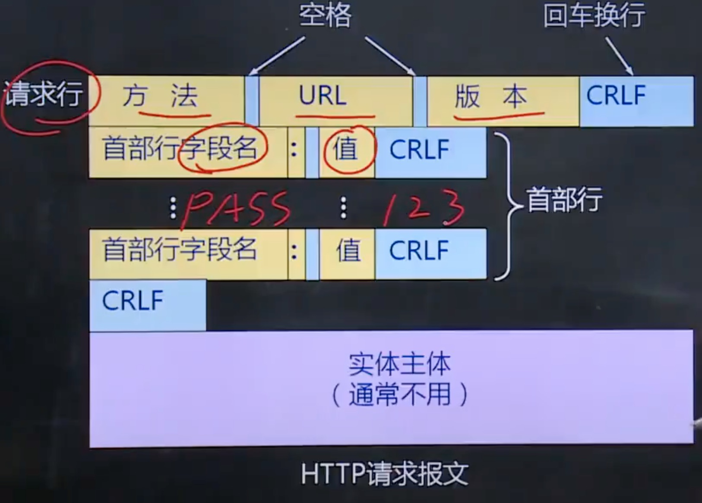
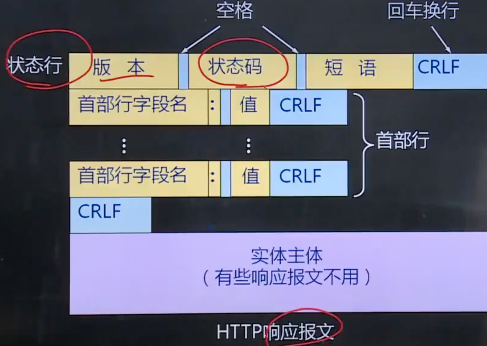
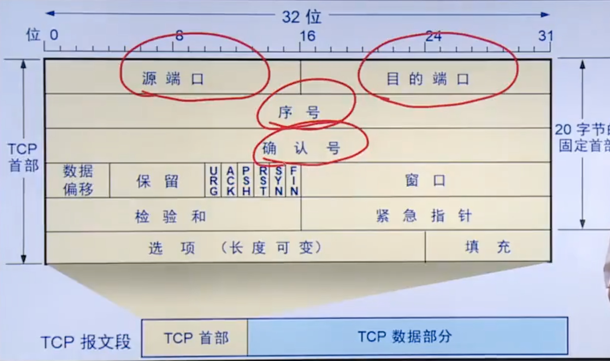
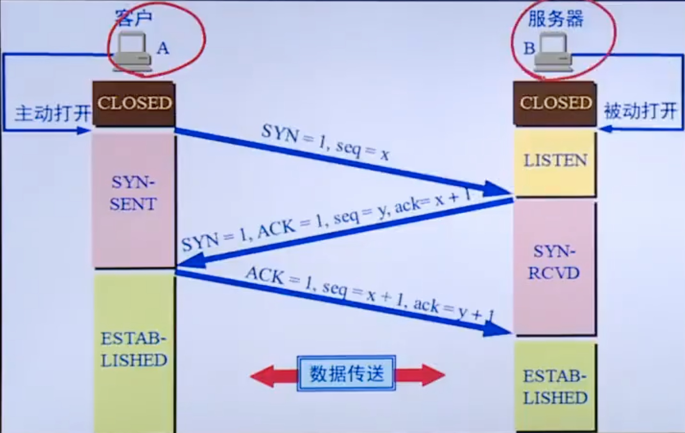
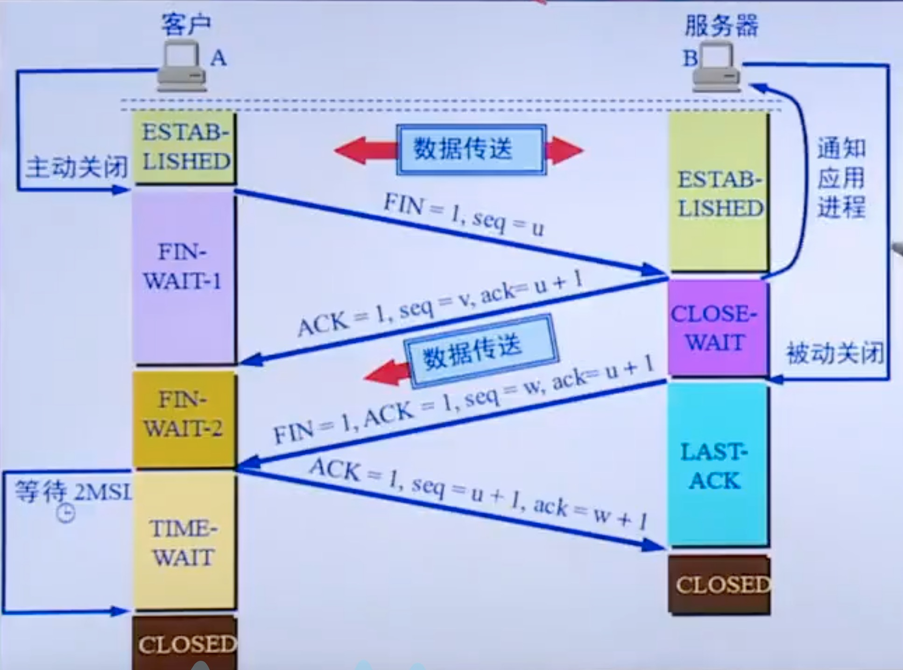
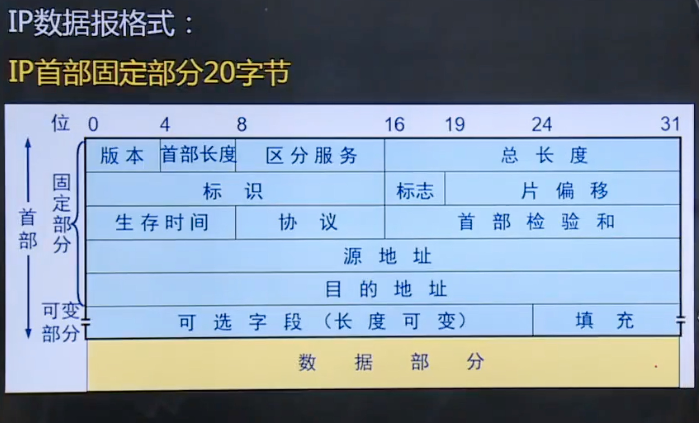

#   第一章 计算机网络概述

## 第一节 计算机网络基本概念

计算机网络是利用通信设备与通信链路或者通信网路互联位置不同, 功能自治的计算机系统, 并遵循一定的规则实现计算机系统之间信息交换

概括定义: 计算机网络是互联的, 自治的计算机集合

### 1. 计算机网络的定义

- 国家级ISP
- 移动网络
- 家庭网络
- 区别或者本地ISP
- 机构网络

### 2. 协议的定义

协议是网络通信实体之间在数据交换过程中需要遵循的规则或者约定, 包括3个基本要素

- 语法
  - 交换信息的格式
- 语义
  - 一些数据所代表的的含义
- 时序
  - 工作顺序

### 3. 计算机网络的功能

- 硬件资源共享
- 软件资源共享
- 信息资源共享

### 4. 计算机网路的分类

- 按覆盖范围分类
  - 个域网
  - 局域网
  - 城域网
  - 广域网
- 按拓扑分类
  - 星型
    - 优点: 易于管理和故障排查, 故障易于隔离
    - 缺点: 依赖中心节点
  - 总线型
    - 优点: 构造简单
    - 缺点: 效率低, 故障不容易定位, 并且故障不能隔离
  - 环形
    - 优点: 构造简单
    - 缺点: 故障不容易定位, 并且故障不能隔离
  - 网状
    - 优点: 通信节点有多个
    - 缺点: 线路复杂, 成本高
  - 树形
  - 混合拓扑
- 按交换方式
  - 电路交换
  - 报文交换
  - 分组交换
- 按用户属性
  - 公有网
  - 私有网

## 第二节 计算机网络结构

### 1. 网络边缘

电脑, 手机都属于网络边缘

连接到网络上的所有终端系统构成了网络边缘

### 2. 接入网络

接入网络实现网络边缘的终端系统与网络核心的链接与接入

1. 电话拨号
2. 非对称用户数字线ADSL
3. 混合光纤同轴电缆HFC
4. 局域网
5. 移动接入网络

### 3. 网络核心

网络核心是由通信互联的分组交换设备构成的网络, 作用是实现网络边缘中主机之间的数据中继与转发

## 第三节 数据交换技术(重要)

### 1. 数据交换的概念

计算机网络的根本目的是在网络边缘的主机之间试下你互相的数据传输. 信息交换

数据交换是实现在大规模网络核心进行数据传输的技术基础

交换节点和传输介质的集合成为通信子网, 即网络核心

### 2. 电路交换

在电路交换网络中, 首先需要通过中间交换节点为两台主机之间建立一条专用的通信网络, 称为电路, 然后再利用该电路进行通信, 通信结束后在拆除电路. 

**电路交换的3个阶段**

1. 建立电路
   1. 传输数据之前, 必须建立一条端对端的电路, 这个电路的建立过程实际上就是一个个交换节点的接续过程
2. 传输数据
   1. 在电路建立之后, 就可以传输数据了, 传输的数据可以是数字数据也可以是模拟数据, 可以是单工也可以是双工
3. 拆除电路
   1. 数据传输完成后, 要释放该屋里链路, 该释放动作可以有两个通信主机之间任意一方发起并完成

- 优点
  - 实时性高(独占线路 ), 时延和时延抖动都较小
- 缺点
  - 对于突发性数据传输, 信道利用率低, 且传输速率单一

### 3. 报文交换

以报文单位在交换网络的各节点之间以存储-转发的方式传送

**特点**

1. 不需要建立连接**(优点)**
2. 只有当报文被转发时才占用响应的信道**(优点)**
3. 交换节点需要缓冲存储, 报文需要排队, **增加可延时**(缺点)

### 4. 分组交换

分组交换将一个完整报文拆分成若干个**分组**, 分组传输过程通常也采用存储-转发的交换方式

**优点:**

1. 交换设备存储容量要求降低
2. 交换速度快
3. 可靠传输效率高
4. 更加公平

**分组长度的确定**

1. 分组长度与延迟时间
2. 分组长度与误码率

 

## 第四节 计算机网络性能

### 1. 速率与带宽

速率是指网络单位时间内传送的数据量, 也称为数据传输速率或数据速率, 速率的基本单位是bit/s(比特/每秒)

在计算机网络中, 有时也会用带宽这一术语描述速率

带宽原本是指信号具有的频带宽度, 即信号成分的最高频率与低频率之差, 单位为Hz(赫兹)

 

### 2. 时延

时延是指数据从网络中的一个节点(主机或交换设备)达到另一节点所需要的时间

分组的每跳传输过程主要产生4类时间延时

1. 节点处时延
   - 每个分组到达交换节点, 交换设备都需要验证分组是否有差错, 根据携带的信息检索转发表, 这些操作就是节点处理时延
2. 排队时延
   - 当一个分组到达交换节点, 经过处理并明确需要从哪个输出链路进行转发后, 分组需要再交换节点内被交换到输出链路, 等待从输出链路发送到下一个交换节点
3. 传输时延
   - 当一个分组在输出链路发送时, 从发送第一位开始, 到发送完最后一位为止, 所用的时间称为传输时延
4. 传播时延
   - 信号从发送端发送出来, 经过一定距离的物理链路到达接收端所需要的时间称为传播时间

### 3. 时延带宽积

一段物理链路的传播时延与链路带宽的乘积

表示一段链路可以容纳的数据位数, 也称为以位为单位的链路长度

### 4. 丢包率

丢包率常被用于评价和衡量网络性能的指标, 在很大程度上可以反映网络的拥塞程度

丢包率 = 丢失分组总数 / 发送分组总数

### 5. 吞吐量

单位时间内源主机通过网络主机向目的主机实际送达的数据量

经常用于度量网络的实际数据传送能力, 即网络实际可以到达的源主机到目的主机的数据传送速率

## 第五节 计算机网络体系结构(重要)

### 1. 计算机网络分层体系结构

**分层的思想**

计算机网络完成的所有功能可以划分为若干层, 每层完成一部分子功能, 每层在完成相应功能时与另一通信实体的项目层按照某种协议进行信息交换

*各厂商发展自己的网络体系结构, 导致个厂商之间设备的通信障碍, 因此迫切需要制定出全世界统一的网络体系结构标准*

**体系结构定义**

计算机网络所划分的层次以及各层协议的集合称为计算机网络体系结构

### 2. OSI 7层参考模型

采用分层结构化技术, 将整个计算机网络通信功能分为7层

1. 物理层
   1. 在传输介质上实现无结构的比特流传输
2. 数据链路层
   1. 实现相邻节点之间数据可靠而有效的传输
3. 网络层
   1. 解决如何将分组通过交换网络传送至目的主机
4. 传输层
   1. 端到端的层次, 也是进程--进程的层次, 数据通信表面是两个主机通信, 其实是两个主机中的两个进程在通信
5. 会话层
   1. 用户与用户的连接, 通过在计算机间建立, 管理和终止通信来完成对话
6. 表示层
   1. 主要用于处理应用实体交换数据的语法, 其目的是解决格式和数据表示的差别
7. 应用层
   1. 应用层与提供给用户的网络服务相关, 这些服务分厂丰富, 包括文件传输, 电子邮件, P2P应用等

**OSI参考模型的有关术语**

**数据单元**: 在层的实体之间传送的比特组称为数据单元

**协议数据单元PDU**: 在对等层之间传送数据单元是按照本层的协议进行, 因此, 这时的数据单元称为协议数据单元PDU

**服务数据单元SDU**

**协议控制信息PCI**

PDU在不同的层有不同的叫法

物理层 - 位流或者比特流

数据链路层 - 帧

网络层 - 分组或者包

传输层 - 数据段或者报文段

应用层 - 报文

### 3. TCP/IP 4层参考模型

实际的网络中几乎没有严格按照OSI参考模型构建的

TCP/IP参考模型包括4层

| 分层       |        | 主要功能                           | 涉及协议                   |
| ---------- | ------ | ---------------------------------- | -------------------------- |
| 应用层     | 报文   | 将会话层和表示层的功能合并到应用层 | HTTP, FTP, SMTP, POP3, DNS |
| 传输层     | 段     |                                    | TCP, UDP                   |
| 网际层     | 数据报 |                                    | IP, ICMP, RIP, OSPF, BGP   |
| 网络接口层 | 帧     |                                    |                            |

### 4. 五层参考模型

| 应用层 | 报文   |
| ------ | ------ |
| 传输层 | 段     |
| 网络层 | 数据报 |
| 链路层 | 帧     |
| 物理层 | 比特   |

## 计算机网络与因特网发展简史

1. 基于电话网络
2. 分组交换
3. TCP/IP协议

# 第二章 网络应用

## 第一节 计算机网络应用体系结构

### 1. 客户/服务器(C/S)结构网络应用

最重要额特征是通信只在客户与服务器之间进行, 客户与客户端之间不进行直接通信

### 2. 纯P2P结构网络应用

每个对等端同时具备C/S应用的客户端与服务器的特征, 是一个服务器与客户的结合体, 对等端之间直接通信

### 3. 混合结构网络应用

既有中心服务器的存在, 又有对等端间的直接通信

## 第二节 网络应用通信基本原理

C/S通信基本原理: 服务器端运行的是服务器进程, 被动的等待客户请求服务, 客户端运行的客户进程, 主动发起通信, 请求服务器进程提供服务, 应用进程间遵循**应用层协议**交换应用层报文

## 第三节 域名系统DNS

Domain Name Service

DNS为了实现域名解析, 需要建立分布式数据库, 存储网络中域名与IP地址的映射关系数据, 这些数据库存储在域名服务器上, 域名服务器根据用户的请求提供域名解析服务.

DNS作为分布式数据库, 域名服务器分布在整个互联网上, 每个域名服务器只存储了部分域名信息, 为了完成域名解析, 通常需在多个域名服务器之间进行查询, 因此DNS也必须定义相应的应用层协议

**将域名映射为IP地址的过程就称为域名解析**

### 1. 层次化域名空间

层次树状结构的命名方法

1. 国家顶级域名 - cn中国 us美国 uk英国
2. 通用顶级域名 - com公司/企业 net网络服务机构 org非营利组织 edu专用教育机构 gov政府部门
3. 基础结构域名 - arpa用=用于反向域名解析, 因此又称为反向域名

### 2. 域名服务器

 **域名服务器的分类**

- 根域名服务器
- 顶级域名服务器
- 权威域名服务器
- 中间域名服务器

**根域名服务器有13台**

a.rootservers.net ......m.rootservers.net

### 3. 域名解析过程

**递归查询**

代替主机或其他域名服务器, 进行进一步的域名查询, 并将查询的结果返回给上一级查询的主机或服务器

**迭代查询**

只是将下一步要查询的服务器告知查询主机或服务器 

## 第四节 万维网应用

### 1. 万维网应用结构

web应用主要包括web服务器, 浏览器, 超文本传输协议

### 2. HTTP

http是web应用的应用协议, 定义浏览器如何向web服务器发送请求, 以及服务器如何向浏览器响应

目前主流是http1.0和http1.1, 尤其以http1.1为主流

http技基于传输层的TCP传输报文, 浏览器在向服务器发送请求前, 首先需要建立TCP连接, 然后才能发送HTTP请求报文

基于http在使用TCP连接策略不同, 可以分为非持久连接和持久连接

#### 非持久连接

指http客户端与服务器建立TCP连接后, 通过该连接发送HTTP请求报文, 接受HTTP报文, 然后断开连接, HTTP1,0默认使用非持久连接, 每次请求传输一个对象都需要建立一个新的TCP链接

优化方案

1. 并行链接
   1. 通过建立多条并行的TCP链接, 并行发送HTTP请求和并行接受响应
2. 持久链接
   1. 重用已经建立的链接发送新的HTTP请求和接受HTTP响应, 从而消除新建TCP链接的时间开销

#### 并行链接

通过并行链接加速或优化HTTP是比较典型的技术手段, 目前几乎所有的浏览器都支持并行链接, 当然支持的并行链接数是有限制的

#### 持久链接

建立一个链接传输多个对象

**非流水式持久连接**

**流水式持久连接**

#### HTTP报文

**请求报文**

HTTP典型的请求方式

- GET: 请求读取由URL所标识的信息
- POST: 给服务器提交信息
- OPTION: 安全预检, 请求一些选项的信息
- HEAD: 读取由URL所标识的信息头部
- PUT: 更新资源

**响应报文**

状态码分类

| 状态码类别 | 取值范围 | 作用       | 说明                                  |
| ---------- | -------- | ---------- | ------------------------------------- |
| 1xx        | 100-199  | 信息提示   | 通告信息, 可能还需要进一步交互        |
| 2xx        | 200-299  | 成功       | 成功完成客户端请求的操作, 并进行响应  |
| 3xx        | 300-399  | 重定向     | 表示资源亿移走, 需要向新的URL发送请求 |
| 4xx        | 400-499  | 客户端错误 | 由于客户端请求错误, 无法成功响应      |
| 5xx        | 500-599  | 服务器错误 | 由于服务器端错误, 无法成功响应        |

常见的状态码

| 状态码 | 短语                       | 含义                                                         |
| ------ | -------------------------- | ------------------------------------------------------------ |
| 100    | continue                   | 表示成功收到请求的初始部分, 请客户端继续                     |
| 200    | OK                         | 成功, 所请求信息在响应报文中                                 |
| 301    | moved permanently          | 重定向, 所请求的对象被永久移走, 在响应报文的首部location会给出新的URL, 通常浏览器会自动重定向 |
| 400    | bad request                | 客户端请求错误, 即服务器不能理解客户端请求                   |
| 401    | unauthorized               | 未授权, 需要输入用户名密码                                   |
| 404    | not found                  | 客户端请求的对象, 在服务器上不存在                           |
| 451    | unsupported media type     | 不支持媒体类型                                               |
| 505    | http version not supported | 所使用HTTP版本, 服务器不支持                                 |

### 3. Cookie

cookie中文名称为小型文本文件, 指某些网站为了辨别用户身份, 进行会话跟踪而存储在用户本地终端上的数据

*弥补了HTTP协议无状态的不足, 有利于进行用户跟踪并提供针对性的服务, 但也带来了一些安全问题*

## 第五节 Internet电子邮件

### 1. 电子邮件系统结构

电子邮件系统主要包括

- 邮件服务器
- 简单邮件传输协议SMTP
- 用户代理
- 邮件读取协议

### 2. SMTP

SMTP是Inernet电子邮件中核心应用层协议, 实现邮件服务器之间或用户代理到邮件服务器之间的邮件传输

SMTP使用传输层TCP实现可靠数据传输

默认端口号为25

SMTP通过3个阶段的应用层交互完成邮件的传输

1. 握手阶段
2. 邮件传输阶段
3. 关闭阶段

SMTP的基本交互方式是SMTP客户端发送命令, 命令后面可能携带参数, SMTP服务器对命令进行应答

### 3. 电子邮件格式与MIME

电子邮件包括首部, 空白行, 主题3部分

TO, Subject, Cc, From, Date, Reply-To等关键字

MINE多用途互联网邮件扩展

将非7为ASCII码文本内容转换为7位ASCII文本内容, 然后再利用SMTP进行传输

*在邮件首部增加MIME首部行, 说明主题内容原本的数据类型以及采用的编码标准等*

### 4. 邮件读取协议

POP3 - TCP - Post Office Protocol-version3 - 第三版的邮局协议 - 默认端口110

IMAP - Inernet mail access protocol - 互联网邮件访问协议

HTTP

## 第六节 FTP

文件传输协议 file transform protocol: 在互联网的两个主机间实现文件互传的应用协议

C/S模式. 采用**控制链接21号端口**传输控制指令, **数据链接20号端口**传输文件内容

## 第七节 P2P应用

p2p应用的优势

充分聚集利用了端系统(对等放主机)的计算能力以及网络传输带宽, 对服务器的依赖小

## 第八节 Sokcet编程基础

# 第三章 传输层

## 第一节 传输层的基本服务

传输层的核心任务是为应用进程之间提供**端到端的逻辑通信服务**

通信的真正端点并不是主机, 而是主机中运行的应用进程

### 1. 传输层功能

- 传输层寻址
- 应用层报文的分段和重组
- 报文的差错检测
- 进程间的端到端可靠数据传输控制
- 面向应用层实现复用与分解
- 端到端的流量控制
- 拥塞控制

### 2. 传输层寻址与端口

用统一的寻址方法对应应用进程进行标识 ---- 端口号

在全球范围内利用 **IP + 端口**唯一标识一个

传输层端口为16位的二进制, 包含三类端口

1. 熟知端口号, 0-1023
2. 登记端口号, 1024-49151, 未没有熟知端口的应用程序使用, 使用这个范围的端口必须在IANA登记, 以防止重复
3. 客户端口号或者短暂端口号, 49152-65535, 留给客户进程选择使用

### 3. 无连接服务与面向连接的服务

**无连接服务 UDP**

数据传输之前无需与对端进行任何信息交换, 直接构造传输层报文段并向接受段发送

**面向连接服务 TCP**

在数据传输之前, 需要双方交换一些控制信息, 建立逻辑连接, 然后再传输数据, 数据传输结束后还需要在拆除连接

## 第二节 传输层的复用与分解

是传输层的一项基本功能, 支持众多应用进程公用同一个传输层协议, 并能够将接受到数据准确交付给不同的应用进程

### 1. 无连接的多路复用与多路分集

目的IP + 目的端口

UDP套接字的端口号是UDP实现复用和分解的重要依据

### 2. 面向连接的多路复用和多路分解

源IP + 源端口号 + 目的IP + 目的端口号

当一个TCP报文段从网络层到达一台主机时, 该主机根据这个4个值来将报文分解到响应的套接字

## 第三节 停-等协议与滑动窗口协议

### 1. 可靠数据传输基本原理

实现可靠数据传输的措施

1. 差错检测: 利用差错编码实现数据包传输过程中的比特差错检测
2. 确认: 接收方 向发送方反馈接受的状态
3. 重传: 发送方重新发送接收方没有正确接受的数据包
4. 序号: 确认数据按序提交
5. 计时器: 解决数据丢失的问题

### 2. 停-等协议

主要特点就是每发送一个报文段 就停下来 等待接收方确认

**基本工作过程**

1. 发送方发送经过差错编码和编号的报文段, 等待接收方的确认 **发送并等待确认**
2. 接收方如果正确接受报文段, 即差错检测无误且序号正确, 则接受报文段, 并向发送方发送ACK, 否则丢弃报文段, 并向发送方发送NAK **接受并确认/否认**
3. 发送方如果收到ACK, 则继续发送后续的报文段, 否则从发刚刚发送的报文段 **继续发送/重发**

### 3. 滑动窗口协议

**停止-等待机制降低了信道的利用率**

1. 解决办法

流水线协议或者管道协议: 允许发送方在没有收到确认前可以连续发送多个分组

2. 流水线协议的改进

增加分组序号的范围

发送方和接收方必须缓存多个分组

3. 典型的流水线协议

滑动窗口协议

**两种具有代表性的滑动窗口协议**

1. 回退N步(GO-Back-N, GBN)

发送端窗口较大, 可以在未得到确认前连续发送多个分组, 但是接收方窗口大小仅为1, 只能接受1个按序到达的分组, 未按序到达的分组或者某个分组差错, 就会引起发送方重发该分组及之后的所有分组

2. 选择重传(selective repeat, SR)

增加接收方的缓存能力(窗口>1), 缓存正确到达但失序的分组, 仅要求发送方重传未被接收方确认的分组, 等缺失分组到达后一并想上层按序提交

## 第四节 用户数据报协议UDP

UDP是Internet传输层协议, 提供无链接的, 不可靠的, 数据报尽力传输服务

### 1. UDP数据报结构

| 源端口号 16位 | 目的端口号 16位 |
| ------------- | --------------- |
| 长度 16位     | 校验和16位      |
| 应用数据      | 应用数据        |

### 2. UDP校验和

1.  对所有参与运算的内容, 包括UDP报文段, 按16位求和
2. 求和过程中遇到的任何溢出(即进位)都被回卷(即进位与和的最低位在加)
3. 最后得到的和取反码

## 第五节 传输控制协议TCP

### 1. TCP报文段结构

### 2. TCP链接管理

#### 建立链接 三次握手

**只要客户端才能发起建立连接的请求**

1. 客户端发起SYN连接请求
2. 服务端ACK回应客户端 , 并向对方发起SYN
3. 客户端ACK回应服务端

**建立链接过程中客户端的状态**

- 关闭状态 CLOSE, 处于初始状态
- 同步已发送状态SYN-SENT
- 已建立状态ESTABLISHED, 表示可以传送数据

**建立连接过程中服务器的状态**

- 关闭状态 CLOSE, 处于初始状态
- 监听状态 LISTEN
- 同步收到状态 SYN_RCVD
- 已建立状态 ESTABLISHED, 表示可以传送数据

#### 断开连接 四次挥手

**客户端和服务端都可以发起端来连接的请求**

### 3. TCP可靠数据传输

TCP的可靠数据传输实现机制包括差错编码, 确认, 序号, 重传, 计时器等

TCP的可靠数据传输是基于滑动窗口协议, 但是发送的窗口大小变化

TCP能够提供可靠的数据传输服务, 是通过一下工作机制实现的

- 应用被分割成TCP认为最适合发送的数据块(MSS), 封装成TCP段, 传递给IP
- 当一个段发出后, 启动一个计时器, 等待目的端口确认收到这个报文段
- TCP首部中舍友校验和字段, 用户检测数据在传输过程中是否发生差错
- 通过序号重新排序, 丢弃重复的报文段
- 流量控制

### 4. TCP流量控制

TCP协议利用窗口机制实现流量控制, 但不是简单的滑动窗口协议

TCP建立连接时, 双方都为之分配了固定大小的缓冲区, TCP的接收端只允许另一端发送其缓冲区能接纳的数据量

- 接收端在给发送端发送确认段时, 通告接受窗口的大小
- 发送端在接下来发送数据时, 确保未确认段的应用层数据总量不超过接收端通告的接受窗口大小, 从而确保接收端不会发生缓存溢出

### 5. TCP拥塞控制

1. 窗口机制

通过调节窗口的大小实现对发送数据速率的调整

2. 窗口调整的基本策略

AIMD 加性增加 乘性减少

3. TCP的拥塞控制算法

包括慢启动, 拥塞避免, 快速重传和快速恢复

# 第四章 网络层

## 第一节 网络层服务

网络层的主要作用是将网络层数据报从源主机发送到目的主机

主要功能包括

- 转发
- 路由选择

## 第二节 数据包网络与虚电路网络

### 1. 数据报网络

按照目的主机地址进行路由选择

特点:

1. 无连接
2. 每个分组都作为一个独立的数据报进行传送, 路径也可能不同
3. 分组可能出现乱序和丢失

### 2. 虚电路网络

虚电路网络在网路层提供面向连接的分组交换服务

特点:

1. 建立一条网络层逻辑连接
2. 不需要为每条虚连接分配独享资源(区别于电路交换)
3. 根据虚电路号沿虚电路路径按序转发

## 第三节 网络互连与网络互连设备

### 1. 异构网络互连

两个网络的通信技术和运行的协议不同就称为异构网络互连

异构网络互连的基本策略

- 协议转换
- 构建虚拟互连网络

### 2. 路由器

路由器是一种具有多个输入和多个输出端口的专用计算机, 主要任务是获取路由信息以及转发分组, 路由器是典型的网络层设备

路由器从功能的体系结构角度分为输入端口, 交换结构, 输出端口与路由处理器

路由处理器: 执行路由器的各种指令, 包括路由协议的运行, 路由计算以及路由表的更新和维护

**交换结构**

- 基于内存的交换
- 基于总线的交换
- 基于网络的交换

## 第四节 网络层拥塞控制

### 1. 网络拥塞

什么是拥塞?

一种持续过载的网络状态, ,此时用户对网络资源(包括链路带宽, 存储空间, 处理器的处理能力等)的总需求超过了网络固有的容量

产生拥塞的原因?

1. 缓冲区容量有限
2. 传输线路的带宽有限
3. 网络节点的CPU处理能力有限
4. 网络中某些部分发生故障

### 2. 流浪感知路由

根据网络负载动态调整, 将网络流量引导到不同的链路上, 均衡网络负载, 从而延缓或避免拥塞发生

解决网络负载震荡现象

1. 多路径路由
2. 缓慢转移流量到另外一条链路

### 3. 准入流量

是一种广泛应用于虚链路网络的拥塞预防技术

基本思想

对新建虚链路进行审核, 如果新建立的虚电路会导致网络变得拥塞, 那么网络拒绝建立该新虚电路

拥塞状况的量化: 基于平均流浪和瞬时流浪

### 4. 流量调节

1. 感知流量
2. 处理拥塞: 将拥塞信息通知到其他上游节点

处理方法:

1. 抑制分组: 给拥塞数据报的源主机返回一个抑制分组
2. 背压: 让抑制分组在从拥塞节点到源节点的路径上的每一跳, 都发挥抑制作用

### 5. 负载脱落

负载脱落: 路由器主动丢弃某些数据报

如何选择要丢弃的数据报

1. 丢弃新分组: 如GBN
2. 丢弃老分组: 如实时的视频流

## 第五节 inertnet网络层

### 1. IPV4协议

标识:判断这些分片是否属于同一个IP数据报

标志: 判断是否为最后一个分片

片偏移: 判断个分片的顺序

### 2. IPV4地址

### 3. 动态主机配置协议

### 4. 网络地址转换

### 5. ICMP

### 6. IPV6

## 第六节 路由算法与路由协议

### 1. 链路状态路由选择算法

### 2. 距离矢量路由算法

### 3. 层次化路由选择

### 4. internet路由选择协议

 