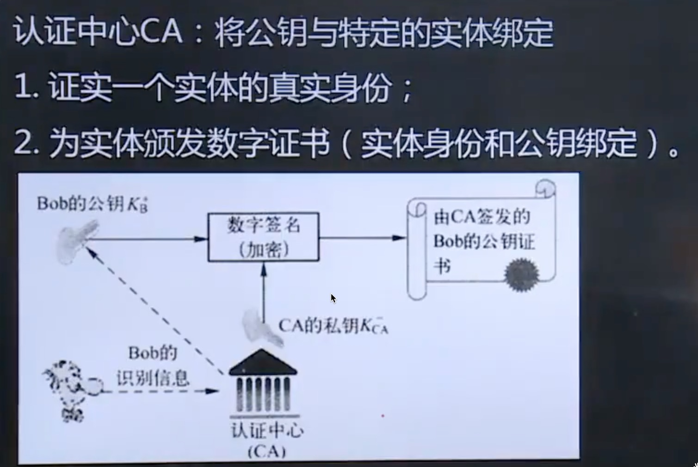

#   第一章 计算机网络概述

## 第一节 计算机网络基本概念

计算机网络是利用通信设备与通信链路或者通信网路互联位置不同, 功能自治的计算机系统, 并遵循一定的规则实现计算机系统之间信息交换

概括定义: 计算机网络是互联的, 自治的计算机集合

### 1. 计算机网络的定义

- 国家级ISP
- 移动网络
- 家庭网络
- 区别或者本地ISP
- 机构网络

### 2. 协议的定义

协议是网络通信实体之间在数据交换过程中需要遵循的规则或者约定, 包括3个基本要素

- 语法
  - 交换信息的格式
- 语义
  - 一些数据所代表的的含义
- 时序
  - 工作顺序

### 3. 计算机网络的功能

- 硬件资源共享
- 软件资源共享
- 信息资源共享

### 4. 计算机网路的分类

- 按覆盖范围分类
  - 个域网
  - 局域网
  - 城域网
  - 广域网
- 按拓扑分类
  - 星型
    - 优点: 易于管理和故障排查, 故障易于隔离
    - 缺点: 依赖中心节点
  - 总线型
    - 优点: 构造简单
    - 缺点: 效率低, 故障不容易定位, 并且故障不能隔离
  - 环形
    - 优点: 构造简单
    - 缺点: 故障不容易定位, 并且故障不能隔离
  - 网状
    - 优点: 通信节点有多个
    - 缺点: 线路复杂, 成本高
  - 树形
  - 混合拓扑
- 按交换方式
  - 电路交换
  - 报文交换
  - 分组交换
- 按用户属性
  - 公有网
  - 私有网

## 第二节 计算机网络结构

### 1. 网络边缘

电脑, 手机都属于网络边缘

连接到网络上的所有终端系统构成了网络边缘

### 2. 接入网络

接入网络实现网络边缘的终端系统与网络核心的链接与接入

1. 电话拨号
2. 非对称用户数字线ADSL
3. 混合光纤同轴电缆HFC
4. 局域网
5. 移动接入网络

### 3. 网络核心

网络核心是由通信互联的分组交换设备构成的网络, 作用是实现网络边缘中主机之间的数据中继与转发

## 第三节 数据交换技术(重要)

### 1. 数据交换的概念

计算机网络的根本目的是在网络边缘的主机之间试下你互相的数据传输. 信息交换

数据交换是实现在大规模网络核心进行数据传输的技术基础

交换节点和传输介质的集合成为通信子网, 即网络核心

### 2. 电路交换

在电路交换网络中, 首先需要通过中间交换节点为两台主机之间建立一条专用的通信网络, 称为电路, 然后再利用该电路进行通信, 通信结束后在拆除电路. 

**电路交换的3个阶段**

1. 建立电路
   1. 传输数据之前, 必须建立一条端对端的电路, 这个电路的建立过程实际上就是一个个交换节点的接续过程
2. 传输数据
   1. 在电路建立之后, 就可以传输数据了, 传输的数据可以是数字数据也可以是模拟数据, 可以是单工也可以是双工
3. 拆除电路
   1. 数据传输完成后, 要释放该屋里链路, 该释放动作可以有两个通信主机之间任意一方发起并完成

- 优点
  - 实时性高(独占线路 ), 时延和时延抖动都较小
- 缺点
  - 对于突发性数据传输, 信道利用率低, 且传输速率单一

### 3. 报文交换

以报文单位在交换网络的各节点之间以存储-转发的方式传送

**特点**

1. 不需要建立连接**(优点)**
2. 只有当报文被转发时才占用响应的信道**(优点)**
3. 交换节点需要缓冲存储, 报文需要排队, **增加可延时**(缺点)

### 4. 分组交换

分组交换将一个完整报文拆分成若干个**分组**, 分组传输过程通常也采用存储-转发的交换方式

**优点:**

1. 交换设备存储容量要求降低
2. 交换速度快
3. 可靠传输效率高
4. 更加公平

**分组长度的确定**

1. 分组长度与延迟时间
2. 分组长度与误码率

 

## 第四节 计算机网络性能

### 1. 速率与带宽

速率是指网络单位时间内传送的数据量, 也称为数据传输速率或数据速率, 速率的基本单位是bit/s(比特/每秒)

在计算机网络中, 有时也会用带宽这一术语描述速率

带宽原本是指信号具有的频带宽度, 即信号成分的最高频率与低频率之差, 单位为Hz(赫兹)

 

### 2. 时延

时延是指数据从网络中的一个节点(主机或交换设备)达到另一节点所需要的时间

分组的每跳传输过程主要产生4类时间延时

1. 节点处时延
   - 每个分组到达交换节点, 交换设备都需要验证分组是否有差错, 根据携带的信息检索转发表, 这些操作就是节点处理时延
2. 排队时延
   - 当一个分组到达交换节点, 经过处理并明确需要从哪个输出链路进行转发后, 分组需要再交换节点内被交换到输出链路, 等待从输出链路发送到下一个交换节点
3. 传输时延
   - 当一个分组在输出链路发送时, 从发送第一位开始, 到发送完最后一位为止, 所用的时间称为传输时延
4. 传播时延
   - 信号从发送端发送出来, 经过一定距离的物理链路到达接收端所需要的时间称为传播时间

### 3. 时延带宽积

一段物理链路的传播时延与链路带宽的乘积

表示一段链路可以容纳的数据位数, 也称为以位为单位的链路长度

### 4. 丢包率

丢包率常被用于评价和衡量网络性能的指标, 在很大程度上可以反映网络的拥塞程度

丢包率 = 丢失分组总数 / 发送分组总数

### 5. 吞吐量

单位时间内源主机通过网络主机向目的主机实际送达的数据量

经常用于度量网络的实际数据传送能力, 即网络实际可以到达的源主机到目的主机的数据传送速率

## 第五节 计算机网络体系结构(重要)

### 1. 计算机网络分层体系结构

**分层的思想**

计算机网络完成的所有功能可以划分为若干层, 每层完成一部分子功能, 每层在完成相应功能时与另一通信实体的项目层按照某种协议进行信息交换

*各厂商发展自己的网络体系结构, 导致个厂商之间设备的通信障碍, 因此迫切需要制定出全世界统一的网络体系结构标准*

**体系结构定义**

计算机网络所划分的层次以及各层协议的集合称为计算机网络体系结构

### 2. OSI 7层参考模型

采用分层结构化技术, 将整个计算机网络通信功能分为7层

1. 物理层
   1. 在传输介质上实现无结构的比特流传输
2. 数据链路层
   1. 实现相邻节点之间数据可靠而有效的传输
3. 网络层
   1. 解决如何将分组通过交换网络传送至目的主机
4. 传输层
   1. 端到端的层次, 也是进程--进程的层次, 数据通信表面是两个主机通信, 其实是两个主机中的两个进程在通信
5. 会话层
   1. 用户与用户的连接, 通过在计算机间建立, 管理和终止通信来完成对话
6. 表示层
   1. 主要用于处理应用实体交换数据的语法, 其目的是解决格式和数据表示的差别
7. 应用层
   1. 应用层与提供给用户的网络服务相关, 这些服务分厂丰富, 包括文件传输, 电子邮件, P2P应用等

**OSI参考模型的有关术语**

**数据单元**: 在层的实体之间传送的比特组称为数据单元

**协议数据单元PDU**: 在对等层之间传送数据单元是按照本层的协议进行, 因此, 这时的数据单元称为协议数据单元PDU

**服务数据单元SDU**

**协议控制信息PCI**

PDU在不同的层有不同的叫法

物理层 - 位流或者比特流

数据链路层 - 帧

网络层 - 分组或者包

传输层 - 数据段或者报文段

应用层 - 报文

### 3. TCP/IP 4层参考模型

实际的网络中几乎没有严格按照OSI参考模型构建的

核心层是网络互连层

TCP/IP参考模型包括4层

| 分层       |        | 主要功能                           | 涉及协议                   |
| ---------- | ------ | ---------------------------------- | -------------------------- |
| 应用层     | 报文   | 将会话层和表示层的功能合并到应用层 | HTTP, FTP, SMTP, POP3, DNS |
| 传输层     | 段     |                                    | TCP, UDP                   |
| 网际层     | 数据报 |                                    | IP, ICMP, RIP, OSPF, BGP   |
| 网络接口层 | 帧     |                                    |                            |

### 4. 五层参考模型

| 应用层 | 报文   |
| ------ | ------ |
| 传输层 | 段     |
| 网络层 | 数据报 |
| 链路层 | 帧     |
| 物理层 | 比特   |

## 计算机网络与因特网发展简史

1. 基于电话网络
2. 分组交换
3. TCP/IP协议

# 第二章 网络应用

## 第一节 计算机网络应用体系结构

### 1. 客户/服务器(C/S)结构网络应用

最重要额特征是通信只在客户与服务器之间进行, 客户与客户端之间不进行直接通信

### 2. 纯P2P结构网络应用

每个对等端同时具备C/S应用的客户端与服务器的特征, 是一个服务器与客户的结合体, 对等端之间直接通信

### 3. 混合结构网络应用

既有中心服务器的存在, 又有对等端间的直接通信

## 第二节 网络应用通信基本原理

C/S通信基本原理: 服务器端运行的是服务器进程, 被动的等待客户请求服务, 客户端运行的客户进程, 主动发起通信, 请求服务器进程提供服务, 应用进程间遵循**应用层协议**交换应用层报文

## 第三节 域名系统DNS

Domain Name Service

DNS为了实现域名解析, 需要建立分布式数据库, 存储网络中域名与IP地址的映射关系数据, 这些数据库存储在域名服务器上, 域名服务器根据用户的请求提供域名解析服务.

DNS作为分布式数据库, 域名服务器分布在整个互联网上, 每个域名服务器只存储了部分域名信息, 为了完成域名解析, 通常需在多个域名服务器之间进行查询, 因此DNS也必须定义相应的应用层协议

**将域名映射为IP地址的过程就称为域名解析**

### 1. 层次化域名空间

层次树状结构的命名方法

1. 国家顶级域名 - cn中国 us美国 uk英国
2. 通用顶级域名 - com公司/企业 net网络服务机构 org非营利组织 edu专用教育机构 gov政府部门
3. 基础结构域名 - arpa用=用于反向域名解析, 因此又称为反向域名

### 2. 域名服务器

 **域名服务器的分类**

- 根域名服务器
- 顶级域名服务器
- 权威域名服务器
- 中间域名服务器

**根域名服务器有13台**

a.rootservers.net ......m.rootservers.net

### 3. 域名解析过程

**递归查询**

代替主机或其他域名服务器, 进行进一步的域名查询, 并将查询的结果返回给上一级查询的主机或服务器

**迭代查询**

只是将下一步要查询的服务器告知查询主机或服务器 

## 第四节 万维网应用

### 1. 万维网应用结构

web应用主要包括web服务器, 浏览器, 超文本传输协议

### 2. HTTP

http是web应用的应用协议, 定义浏览器如何向web服务器发送请求, 以及服务器如何向浏览器响应

目前主流是http1.0和http1.1, 尤其以http1.1为主流

http技基于传输层的TCP传输报文, 浏览器在向服务器发送请求前, 首先需要建立TCP连接, 然后才能发送HTTP请求报文

基于http在使用TCP连接策略不同, 可以分为非持久连接和持久连接

#### 非持久连接

指http客户端与服务器建立TCP连接后, 通过该连接发送HTTP请求报文, 接受HTTP报文, 然后断开连接, HTTP1,0默认使用非持久连接, 每次请求传输一个对象都需要建立一个新的TCP链接

优化方案

1. 并行链接
   1. 通过建立多条并行的TCP链接, 并行发送HTTP请求和并行接受响应
2. 持久链接
   1. 重用已经建立的链接发送新的HTTP请求和接受HTTP响应, 从而消除新建TCP链接的时间开销

#### 并行链接

通过并行链接加速或优化HTTP是比较典型的技术手段, 目前几乎所有的浏览器都支持并行链接, 当然支持的并行链接数是有限制的

#### 持久链接

建立一个链接传输多个对象

**非流水式持久连接**

**流水式持久连接**

#### HTTP报文

**请求报文**

HTTP典型的请求方式

- GET: 请求读取由URL所标识的信息
- POST: 给服务器提交信息
- OPTION: 安全预检, 请求一些选项的信息
- HEAD: 读取由URL所标识的信息头部
- PUT: 更新资源

**响应报文**

状态码分类

| 状态码类别 | 取值范围 | 作用       | 说明                                  |
| ---------- | -------- | ---------- | ------------------------------------- |
| 1xx        | 100-199  | 信息提示   | 通告信息, 可能还需要进一步交互        |
| 2xx        | 200-299  | 成功       | 成功完成客户端请求的操作, 并进行响应  |
| 3xx        | 300-399  | 重定向     | 表示资源亿移走, 需要向新的URL发送请求 |
| 4xx        | 400-499  | 客户端错误 | 由于客户端请求错误, 无法成功响应      |
| 5xx        | 500-599  | 服务器错误 | 由于服务器端错误, 无法成功响应        |

常见的状态码

| 状态码 | 短语                       | 含义                                                         |
| ------ | -------------------------- | ------------------------------------------------------------ |
| 100    | continue                   | 表示成功收到请求的初始部分, 请客户端继续                     |
| 200    | OK                         | 成功, 所请求信息在响应报文中                                 |
| 301    | moved permanently          | 重定向, 所请求的对象被永久移走, 在响应报文的首部location会给出新的URL, 通常浏览器会自动重定向 |
| 400    | bad request                | 客户端请求错误, 即服务器不能理解客户端请求                   |
| 401    | unauthorized               | 未授权, 需要输入用户名密码                                   |
| 404    | not found                  | 客户端请求的对象, 在服务器上不存在                           |
| 451    | unsupported media type     | 不支持媒体类型                                               |
| 505    | http version not supported | 所使用HTTP版本, 服务器不支持                                 |

### 3. Cookie

cookie中文名称为小型文本文件, 指某些网站为了辨别用户身份, 进行会话跟踪而存储在用户本地终端上的数据

*弥补了HTTP协议无状态的不足, 有利于进行用户跟踪并提供针对性的服务, 但也带来了一些安全问题*

## 第五节 Internet电子邮件

### 1. 电子邮件系统结构

电子邮件系统主要包括

- 邮件服务器
- 简单邮件传输协议SMTP
- 用户代理
- 邮件读取协议

### 2. SMTP

SMTP是Inernet电子邮件中核心应用层协议, 实现邮件服务器之间或用户代理到邮件服务器之间的邮件传输

SMTP使用传输层TCP实现可靠数据传输

默认端口号为25

**特点**

1. 只能传送7位ASCII码文本内容
2. 传送的内容中不能包含CRLF.CRLF, 因为该信息表示邮件内容的结束
3. 是推动协议
4. 使用TCP链接

SMTP通过3个阶段的应用层交互完成邮件的传输

1. 握手阶段
2. 邮件传输阶段
3. 关闭阶段

SMTP的基本交互方式是SMTP客户端发送命令, 命令后面可能携带参数, SMTP服务器对命令进行应答

### 3. 电子邮件格式与MIME

电子邮件包括首部, 空白行, 主题3部分

TO, Subject, Cc, From, Date, Reply-To等关键字

MINE多用途互联网邮件扩展

将非7为ASCII码文本内容转换为7位ASCII文本内容, 然后再利用SMTP进行传输

*在邮件首部增加MIME首部行, 说明主题内容原本的数据类型以及采用的编码标准等*

### 4. 邮件读取协议

POP3 - TCP - Post Office Protocol-version3 - 第三版的邮局协议 - 默认端口110

IMAP - Inernet mail access protocol - 互联网邮件访问协议

HTTP

## 第六节 FTP

文件传输协议 file transform protocol: 在互联网的两个主机间实现文件互传的应用协议

C/S模式. 采用**控制链接21号端口**传输控制指令, **数据链接20号端口**传输文件内容

## 第七节 P2P应用

p2p应用的优势

充分聚集利用了端系统(对等放主机)的计算能力以及网络传输带宽, 对服务器的依赖小

## 第八节 Sokcet编程基础

# 第三章 传输层

## 第一节 传输层的基本服务

传输层的核心任务是为应用进程之间提供**端到端的逻辑通信服务**

通信的真正端点并不是主机, 而是主机中运行的应用进程

### 1. 传输层功能

- 传输层寻址
- 应用层报文的分段和重组
- 报文的差错检测
- 进程间的端到端可靠数据传输控制
- 面向应用层实现复用与分解
- 端到端的流量控制
- 拥塞控制

### 2. 传输层寻址与端口

用统一的寻址方法对应应用进程进行标识 ---- 端口号

在全球范围内利用 **IP + 端口**唯一标识一个

传输层端口为16位的二进制, 包含三类端口

1. 熟知端口号, 0-1023
2. 登记端口号, 1024-49151, 未没有熟知端口的应用程序使用, 使用这个范围的端口必须在IANA登记, 以防止重复
3. 客户端口号或者短暂端口号, 49152-65535, 留给客户进程选择使用

### 3. 无连接服务与面向连接的服务

**无连接服务 UDP**

数据传输之前无需与对端进行任何信息交换, 直接构造传输层报文段并向接受段发送

**面向连接服务 TCP**

在数据传输之前, 需要双方交换一些控制信息, 建立逻辑连接, 然后再传输数据, 数据传输结束后还需要在拆除连接

## 第二节 传输层的复用与分解

是传输层的一项基本功能, 支持众多应用进程公用同一个传输层协议, 并能够将接受到数据准确交付给不同的应用进程

### 1. 无连接的多路复用与多路分集

目的IP + 目的端口

UDP套接字的端口号是UDP实现复用和分解的重要依据

### 2. 面向连接的多路复用和多路分解

源IP + 源端口号 + 目的IP + 目的端口号

当一个TCP报文段从网络层到达一台主机时, 该主机根据这个4个值来将报文分解到响应的套接字

## 第三节 停-等协议与滑动窗口协议

### 1. 可靠数据传输基本原理

实现可靠数据传输的措施

1. 差错检测: 利用差错编码实现数据包传输过程中的比特差错检测
2. 确认: 接收方 向发送方反馈接受的状态
3. 重传: 发送方重新发送接收方没有正确接受的数据包
4. 序号: 确认数据按序提交
5. 计时器: 解决数据丢失的问题

### 2. 停-等协议

主要特点就是每发送一个报文段 就停下来 等待接收方确认

**基本工作过程**

1. 发送方发送经过差错编码和编号的报文段, 等待接收方的确认 **发送并等待确认**
2. 接收方如果正确接受报文段, 即差错检测无误且序号正确, 则接受报文段, 并向发送方发送ACK, 否则丢弃报文段, 并向发送方发送NAK **接受并确认/否认**
3. 发送方如果收到ACK, 则继续发送后续的报文段, 否则从发刚刚发送的报文段 **继续发送/重发**

### 3. 滑动窗口协议

**停止-等待机制降低了信道的利用率**

1. 解决办法

流水线协议或者管道协议: 允许发送方在没有收到确认前可以连续发送多个分组

2. 流水线协议的改进

增加分组序号的范围

发送方和接收方必须缓存多个分组

3. 典型的流水线协议

滑动窗口协议

**两种具有代表性的滑动窗口协议**

1. 回退N步(GO-Back-N, GBN)

发送端窗口较大, 可以在未得到确认前连续发送多个分组, 但是接收方窗口大小仅为1, 只能接受1个按序到达的分组, 未按序到达的分组或者某个分组差错, 就会引起发送方重发该分组及之后的所有分组

2. 选择重传(selective repeat, SR)

增加接收方的缓存能力(窗口>1), 缓存正确到达但失序的分组, 仅要求发送方重传未被接收方确认的分组, 等缺失分组到达后一并想上层按序提交

## 第四节 用户数据报协议UDP

UDP是Internet传输层协议, 提供无链接的, 不可靠的, 数据报尽力传输服务

### 1. UDP数据报结构

| 源端口号 16位 | 目的端口号 16位 |
| ------------- | --------------- |
| 长度 16位     | 校验和16位      |
| 应用数据      | 应用数据        |

### 2. UDP校验和

1.  对所有参与运算的内容, 包括UDP报文段, 按16位求和
2. 求和过程中遇到的任何溢出(即进位)都被回卷(即进位与和的最低位在加)
3. 最后得到的和取反码

## 第五节 传输控制协议TCP

### 1. TCP报文段结构

### 2. TCP链接管理

#### 建立链接 三次握手

**只要客户端才能发起建立连接的请求**

1. 客户端发起SYN连接请求
2. 服务端ACK回应客户端 , 并向对方发起SYN
3. 客户端ACK回应服务端

**建立链接过程中客户端的状态**

- 关闭状态 CLOSE, 处于初始状态
- 同步已发送状态SYN-SENT
- 已建立状态ESTABLISHED, 表示可以传送数据

**建立连接过程中服务器的状态**

- 关闭状态 CLOSE, 处于初始状态
- 监听状态 LISTEN
- 同步收到状态 SYN_RCVD
- 已建立状态 ESTABLISHED, 表示可以传送数据

#### 断开连接 四次挥手

**客户端和服务端都可以发起端来连接的请求**

### 3. TCP可靠数据传输

TCP的可靠数据传输实现机制包括差错编码, 确认, 序号, 重传, 计时器等

TCP的可靠数据传输是基于滑动窗口协议, 但是发送的窗口大小变化

TCP能够提供可靠的数据传输服务, 是通过一下工作机制实现的

- 应用被分割成TCP认为最适合发送的数据块(MSS), 封装成TCP段, 传递给IP
- 当一个段发出后, 启动一个计时器, 等待目的端口确认收到这个报文段
- TCP首部中舍友校验和字段, 用户检测数据在传输过程中是否发生差错
- 通过序号重新排序, 丢弃重复的报文段
- 流量控制

### 4. TCP流量控制

TCP协议利用窗口机制实现流量控制, 但不是简单的滑动窗口协议

TCP建立连接时, 双方都为之分配了固定大小的缓冲区, TCP的接收端只允许另一端发送其缓冲区能接纳的数据量

- 接收端在给发送端发送确认段时, 通告接受窗口的大小
- 发送端在接下来发送数据时, 确保未确认段的应用层数据总量不超过接收端通告的接受窗口大小, 从而确保接收端不会发生缓存溢出

### 5. TCP拥塞控制

1. 窗口机制

通过调节窗口的大小实现对发送数据速率的调整

2. 窗口调整的基本策略

AIMD 加性增加 乘性减少

3. TCP的拥塞控制算法

包括慢启动, 拥塞避免, 快速重传和快速恢复

# 第四章 网络层

## 第一节 网络层服务

网络层的主要作用是将网络层数据报从源主机发送到目的主机

主要功能包括

- 转发
- 路由选择

## 第二节 数据包网络与虚电路网络

### 1. 数据报网络

按照目的主机地址进行路由选择

特点:

1. 无连接
2. 每个分组都作为一个独立的数据报进行传送, 路径也可能不同
3. 分组可能出现乱序和丢失

### 2. 虚电路网络

虚电路网络在网路层提供面向连接的分组交换服务

特点:

1. 建立一条网络层逻辑连接
2. 不需要为每条虚连接分配独享资源(区别于电路交换)
3. 根据虚电路号沿虚电路路径按序转发

## 第三节 网络互连与网络互连设备

### 1. 异构网络互连

两个网络的通信技术和运行的协议不同就称为异构网络互连

异构网络互连的基本策略

- 协议转换
- 构建虚拟互连网络

### 2. 路由器

路由器是一种具有多个输入和多个输出端口的专用计算机, 主要任务是获取路由信息以及转发分组, 路由器是典型的网络层设备

路由器从功能的体系结构角度分为输入端口, 交换结构, 输出端口与路由处理器

路由处理器: 执行路由器的各种指令, 包括路由协议的运行, 路由计算以及路由表的更新和维护

**交换结构**

- 基于内存的交换 类似于CPU中断的方式
- 基于总线的交换 有独占特性
- 基于网络的交换 性能最好

## 第四节 网络层拥塞控制

### 1. 网络拥塞

什么是拥塞?

一种持续过载的网络状态, ,此时用户对网络资源(包括链路带宽, 存储空间, 处理器的处理能力等)的总需求超过了网络固有的容量

产生拥塞的原因?

1. 缓冲区容量有限
2. 传输线路的带宽有限
3. 网络节点的CPU处理能力有限
4. 网络中某些部分发生故障

### 2. 流浪感知路由

根据网络负载动态调整, 将网络流量引导到不同的链路上, 均衡网络负载, 从而延缓或避免拥塞发生

解决网络负载震荡现象

1. 多路径路由
2. 缓慢转移流量到另外一条链路

### 3. 准入控制

是一种广泛应用于虚链路网络的拥塞预防技术

基本思想

对新建虚链路进行审核, 如果新建立的虚电路会导致网络变得拥塞, 那么网络拒绝建立该新虚电路

拥塞状况的量化: 基于平均流浪和瞬时流浪

### 4. 流量调节

1. 感知流量
2. 处理拥塞: 将拥塞信息通知到其他上游节点

处理方法:

1. 抑制分组: 给拥塞数据报的源主机返回一个抑制分组
2. 背压: 让抑制分组在从拥塞节点到源节点的路径上的每一跳, 都发挥抑制作用

### 5. 负载脱落

负载脱落: 路由器主动丢弃某些数据报

如何选择要丢弃的数据报

1. 丢弃新分组: 如GBN
2. 丢弃老分组: 如实时的视频流

## 第五节 inertnet网络层

### 1. IPV4协议

标识:判断这些分片是否属于同一个IP数据报

标志: 判断是否为最后一个分片

片偏移: 判断个分片的顺序

### 2. IPV4地址

IP地址由 **网络位** 和 **主机位** 组成

**子网划分**

将一个较大的子网划分为多个较小的子网的过程

较大的子网具有较短的网络前缀, 较小的子网具有稍长的前缀

**超网**

将具有较长前缀的相对较小的子网合并为一个具有稍短前缀的相对较大的子网

**子网掩码**

用来定义一个子网的网络前缀长度

**分组转发**

查找路由表

最长前缀匹配

**路由聚合**

将相同路由的连续子网合并, 优化路由查表的速度

### 3. 动态主机配置协议 DHCP

为网络中的主机提供动态IP地址分配服务

1. DHCP服务发现
2. DHCP服务器提供
3. DHCP服务器请求
4. DHCP服务器确认

### 4. 网络地址转换 NAT

1. 使私有地址访问互联网
2. 提高安全性, 不直接暴露在公网了

**从内网进如互联网的IP数据报**

将其源IP地址替换为NAT服务器拥有的合法的公共IP地址, 同时替换源端口号, 并将替换记录记录到NAT转换表中

**从互联网返回的IP数据报**

依据其目的的IP地址与目的端口检索NAT转换表, 得到内部私有地址和端口, 替换地址IP和目的端口, 然后将数据报转发到内部网络 

### 5. 互联网控制报文协议 ICMP

在主机或路由之间, 实现差错信息报告

ICMP差错报文共有5种

1. 重点不可达
2. 源点抑制
3. 时间超时
4. 参数问题
5. 路由重定向

ICMP询问报文

1. 回声 echo请求/应答
2. 时间戳  请求/应答

### 6. IPV6

1. 解决IPv4地址耗尽的问题
2. IPv6报文首部长度固定在40字节
3. IPv6地址长度128位
4. IPv4到IPv6的迁移
   1. 双协议栈
   2. 隧道

IPv6地址包括包括3种类型

1. 单播地址
2. 组播地址
3. 任播地址

## 第六节 路由算法与路由协议

### 1. 链路状态路由选择算法

链路状态路由选择算法时一种全局路由选择算法

每个路由器通过从其他路由器获得的链路状态信息, 得出整个网络的拓扑图

计算最短路径 --- Dijkstra算法

### 2. 距离矢量路由算法

每个节点基于其邻居节点间的直接链路距离, 以及邻居交换过来的距离向量, 计算并更新其到每个目的的节点的最短距离, 然后将新距离向量在通知给其其他邻居

### 3. 层次化路由选择

实现大规模网络路由虚着呢则最有效的, 可行的解决办法, 划分自治系统

网络路由

自治系统间路由协议

### 4. internet路由选择协议

- 内部网关协议
  - RIP
    - 基于距离矢量路由选择算法, 跳数作为距离度量, 最大距离不超过15跳, 每30秒交换一次距离向量
  - OSPF
    - 基于链路状态路由选择算法
- 外部网关协议
  - BGP

 

# 第五章 数据链路层与局域网

## 第一节 数据链路层服务

沿着通信链路连接的相邻节点的通信信道称为链路

数据链路层传输的数据单元是: 帧

数据链路层通常提供已下几点服务

1. 组帧
   1. 数据链路层将要传输的数据封装成帧, 称为组帧或成帧
   2. 帧头包括发送节点和接受节点的信息
   3. 帧尾包含用于差错检测的差错编码
2. 链路接入
   1. 物理链路层可以分为点对点链路和广播链路两大类
   2. 在点对点链路中, 发送点和接收点独占通信链路
   3. 在广播链路中, 通信链路被多个节点共享, 任意两个节点之间发送帧, 都会彼此干扰, 导致帧传输失败
3. 可靠交付
   1. 数据链路层协议也可能提供可靠交付的服务, 即在相邻节点间数据链路实现数据报的可靠传输, 停等协议, 滑动窗口等都适用于数据链路层
   2. 并不是所有的数据链路层都需要设计成可靠传输协议
4. 差错控制
   1. 数据链路层帧在物理媒介上的传播过程, 可能会产生比特翻转的差错, 为了保证出现差错的帧不再被处理和继续传输, 数据链路层协议通常都会采用不同的差错控制措施
      1. 通过确认重传纠正差错
      2. 直接丢弃差错帧

## 第二节 差错控制

### 1. 差错控制的基本方式

- 检错重发
  - 发送端对 待发送数据进行差错编码, 编码后的数据通过信道进行传输, 接收端利用差错编码检测数据是否出错, 对于出错的数据, 接收端请求发送端重发数据加以纠正
- 前项纠错 FEC
  - 接收端利用纠错编码检测数据传输过程中是否发生了错误, 如果发送了错误还可以利用纠错编码定位错误并加以纠正
- 反馈校验
  - 接受端将收到的信息原封不动发回发送 端, 发送端通过 比对 接受端反馈的数据可以确认接受端是否无误的接受了已经发送的数据
- 检错丢弃
  - 不同的网络对可靠性的要求不同, 不纠正出错的数据, 而是直接丢弃错误数据

### 2. 差错编码的基本原理

### 3. 差错编码的检错和纠错能力

汉明距离

### 4. 典型的差错编码

1. 奇偶校验码
   1. 奇校验: 增加一个奇偶校验位, 保证编码后的码字中"1"的个数为奇数
   2. 偶校验: 增肌一个奇偶校验位, 保证编码后的码字中"0"的个数为偶数
2. 汉明码
   1. 可以实现单个比特差错纠正
3. 循环冗余码CRC
   1. 检错能力强, 编码效率高, 实现简单
   2. CRC编码是一类重要的线性分组码, 也称为多项式编码
   3. 异或运算, **一样的为0, 不一样的为1**

## 第三节 多路访问控制协议

### 1. 信道划分MAC协议

多路访问控制协议

1. 频分多路复用 FDM
   1. 在频域内将信道带宽划分为多个子信道
2. 时分多路复用 TDM, 
   1. 统计时分福多路复用 STDM
   2. 异步时分多路复用 ATDM
   3. 将通信信道的传输信号在时域内划分成等长的时隙
3. 波分多路复用 WDM
   1. 在一根光纤中, 传输多路不同波长的光信号
4. 码分多路复用 CDM
   1. 从编码层进行划分, 使得编码后的信号在同一信道中混合传输

### 2. 随机访问MAC协议

**ALOHA协议**

1. 纯ALOHA
   1. 直接将帧发送至信道, 然后对信道进行监听, 等待接受站的回应, 表示发送成功, 如果没有回应则认为发送失败, 等待下一个随机时间后进行重发
2. 时隙ALOHA
   1. 将信道的时间分成离散的时隙, 每个时隙为一帧发送所需要的时间
   2. 每个通信站只能在每个时隙开始时发送帧, 如果在一个时隙内发送出现冲突, 下一个时隙以概率P重发该帧

**载波侦听多路访问**

发送前监听信道是否空闲

1. 非坚持CSMA(**如果监听信道忙, 就等一会在监听, 空闲时立刻发送**)
   1. 如果信道空闲, 立即发送数据
   2. 如果信道忙, 等待一个随机时间, 重新开始侦听信道, 尝试发送数据
   3. 若产生冲突, 则等待下一个随机时间, 然后重新开始侦听信道, 尝试发送数据
   4. 优点是减少冲突的概率, 缺点是信道利用率低
2. 1-坚持CSMA(**如果信道忙, 会一直监听信道, 等待空闲, 然后立刻发送**)
   1. 若通信站有数据发送, 先侦听信道
   2. 若发现信道空闲, 则立即发送数据
   3. 若发现信道忙, 则继续侦听信道直到发现信道空闲, 然后立即发送数据
3. P-坚持CSMA(增加了一个时隙的概念)
   1. 若通信站有数据发送, 先侦听信道
   2. 若发现信道空闲, 则以概率P在最近的时隙开始时刻发送数据
   3. 若信道忙, 则等待下一个时隙, 重新开始发送过程
   4. 若发送出现冲突, 则等待一个随机时间, 然后重新开始发送过程

**带冲突检测的载波监听多路访问 **CSMA/CD

监听空闲后发送, 发送时检测碰撞, 碰撞后等待重发

**边发送边检测**

### 3. 受控接入MAC协议

1. 集中式控制
   1. 由一个主机负责调度其他通信站接入信道, 从而避免冲突
   2. 主要方法: 轮询技术, 又分为轮叫轮询和传递轮询
2. 分散式控制
   1. 典型的方法: 令牌技术, 如令牌环网, 谁有令牌谁能发送, 将令牌进行传递轮询

## 第四节 局域网

### 1. 数据链路层寻址与ARP

**MAC地址**

每个接口对应一个MAC地址, 全球唯一

MAC地址长度为48位, 6个字节

前24位代表厂商, 后24位代表厂商内部编码

**地址解析协议 ARP广播**

以广播的方式根据IP地址查询MAC地址

### 2. 以太网

IEEE802.3标准

采用CSMA/CD访问控制方法

以太网技术

- 10Base-5 10M 基带传输 单端线缆最大传输距离500米(同轴电缆)
- 10Base-T 10M 基带传输 五类双绞线
- 10Base-2 10M 基带传输 单端线缆最大传输距离185米(细同轴电缆)
- 快速以太网100Base-TX 100M T代表双绞线
- 快速以太网100Base-T4
- 快速以太网100Base-FX 100M F代表光纤
- 千兆以太网
- 万兆以太网

### 3. 交换机

**1. 转发和过滤**

采用交换机避免信道冲突

根据转发和过滤的特性,将接受到的链路层帧, 有选择性的转发到响应的端口

以目的MAC地址为主键, 查找交换表

**2. MAC表自学习**

交换机通过自学习构建交换表

**3. 优点**

1. 消除冲突, 提高性能
2. 只会异质链路
3. 易于进行网络管理

### 4. 虚拟局域网

一种基于交换机(支持VLAN功能的)的逻辑分割广播域的局域网应用形式

不受物理位置的限制, 以软件的方式划分和管理域中的工作组

优点:

1. 能够抑制广播风暴
2. 有利于管理, 提高安全性, 更灵活

vlan的划分方法

1. 基于交换机端口的划分
2. 基于MA地址的划分
3. 基于上层协议类型或地址划分

## 第五节 点对点链路协议

### 1. PPP 点对点协议

能够处理差错检测, 支持多种上层协议, 允许连接时协商IP地址, 允许身份认证

典型的应用: 拨号上网

功能:

1. 封装成帧
2. 链路控制协议LCP 负责PPP链路的建立和拆除
3. 网络控制协议NCP 负责IP的协商, 身份的认证

在PPP的基础上衍生了PPPoE和ADSL协议

PPP定义了一个特殊的控制转义字节 01111101

### 2. HDLC协议

高级数据链路控制

可应用于点对点链路和多对多点链路

帧定界:

帧的定界符是 01111110

使用0比特填充的方式方式数据和定界符混淆的情

位填充:

只要发现5个连续的1就是后面插入一个0

接收端反之

# 第六章 物理层

## 第一节 数据通信基础

### 1. 数据通信基本概念

- 消息: 人类能够感知的描述称为消息
- 信息: 信息对事物状态或存在方式的不确定性表述, **信息是可以度量的**
- 通信: 本质就是在一点精确或近似地再生另一点的信息
- 通信系统: 能够实现通信功能的各种技术, 设备和方法的总体
- 信号: 通信系统中, 在传输通道中传播的信息的载体就是信号
- 数据: 对客观事物的性质状态以及相互关系等进行记载的符号及其组合
- 信道: 信道是以传输介质为基础的信号通道

### 2. 数据通信系统模型

- 信源: 将消息转换为信号的设备, 如电话, 摄像机, 计算机等
- 发送设备: 将信源产生的信号进行适当的交换装置, 使之能够在信道中传输, 变换的方式主要包括编码和调制
- 信道: 信号传输的媒介, 总体上可以分为有线信道和无线信道, 如同轴电缆, 双绞线, 光纤, 大气层, 外层空间等
- 接受设备: 完成发送设备的反变换, 即进行译码和解调, 还原原始的发送信号
- 信号的终点, 并将信号转换成供人类能够识别的消息
- 噪声: 自然界和通信设备中固有的, 对通信信号产生干扰和影响的各种信号, 影响传输率和可靠性

**模拟信号**

信号的变量是连续的

**数字信号**

因变量是离散的

 **数据通信方式**

- 单项通信: 单工
- 双向交替通信: 半双工
- 双向同时通信; 全双工
- 并行通信
- 串行通信
- 异步通信
- 同步通信

**数据通信系统的必要功能**

- 信道的利用
- 接口及信号的产生
- 同步
- 差错检测与纠正
- 寻址和路由
- 网络管理
- 安全保证 

## 第二节 物理介质

### 1. 导引型传输介质(有线)

#### 架空明线

架空明线是指平行且互相分离或绝缘的架空裸线线路, 通常采用铜线或铝线等金属导线

#### 双绞线

两根相互绝缘的铜线并排胶合在一起, 检查对邻导线的电磁干扰

双绞线分为两种 

- 屏蔽双绞线 STP
- 非屏蔽双绞线 UTP(用的比较多, 成本低)

**双绞线的缺点是抗干扰能力较差**

#### 同轴电缆

扛电磁干扰能力强, 但是效率低, 材质硬, 不易使用

现在主要用于频带传输, 如有线电视

#### 光纤

基本原理是利用光的全反射

优点:

- 通信容量大
- 传输距离远
- 抗电磁干扰能力强
- 保密性好

种类

- 多模光纤
- 单模光纤 传输距离更远

### 2. 非导引型传输介质(无线)

#### 地波传播 

低频信号, 沿着地球表面传播

#### 天波传播

较高频信号, 利用电离层的反射传播

#### 视线传播

高频信号, 点对点直线传播, 中继传输 

## 第三节 信道与信道容量

### 1. 信道分类与模型

狭义信道: 信号传输介质

广义信道: 信号传输介质和通信系统的一些变换装置

#### 调制信道

信道从调制器的输出端 传输到 解调器的输入端 经过的部分

#### 编码信道

数字信号由编码器输出端 传输到 译码器输入端 经过的部分

### 2. 信道传输特性

#### 恒惨信道

各种有限信道和部分无线信道, 传输特性变化小, 缓慢, 如微波视线传播链路和卫星链路等

- 对信号幅值产生固定的衰减
- 对信号输出产生固定的时延

#### 随参信道

传输特性随时间随机快速变化

- 信号的传输衰减随时间随机变化
- 信号的传输时延随四件随机变化
- 存在多径传播的现象

### 3. 信道容量

## 第四节 基带传输

### 1. 基带传输基本概念

### 2. 数据基带传输编码

#### 双向码

前后后期相反

1前半周器为正, 后半周期为负

0: 前半周期为负, 后半周期为正

#### 查分双向码

不管是1还是0 后半周期要跳变

如果为0, 前半周期, 和前一个周期的后半周期保持一直

如果为1, 前半周期一定要跳变

## 第五节 频带传输

### 1. 频带传输基本该概念

### 2. 频带传输中三种调制方式

## 第六节 物理层接口规程

### 1. 物理层接口概述

物理层接口四大特性

- 机械特性
  - 通信实体间硬件连接接口的机械特点
- 电器特性
  - 在物理连接上, 导线的电器连接及有关电路的特性
- 功能特性
  - 物理接口上各条信号线的用途
- 规程特性
  - 指明利用接口传输比特流的全过程, 以及各项用于传输的时间发生的合法顺序

DTE: 数据终端设备 电脑

DCE: 数据终端接设备 调制解调器

### 2. 物理成接口特性

# 第七章 无线与移动网络

## 第一节 无线网络

### 1. 无线网络基本结构

- 无线主机
- 无线链路
- 基站
- 网络基础设施
- 自组织网络(Ad hoc)

### 2. 无线链路与无线网络特性

1. 信号强度的衰减
2. 信号的干扰
3. 存在多径传播的问题
4. 隐藏终端

## 第二节 移动网络

### 1. 移动网络基本原理

1. 不同的移动性需求
2. 网络层地址保持不变的主要性
3. 有线基础设施的支持

### 2. 寻址

归属网络   归属代理   永久地址

访问网络   外部代理   转交地址

### 3. 移动节点的网络选择

#### 间接路由选择

由归属代理转发数据给外部代理

 

#### 直接路由选择

由通信代理通过归属代理获得转交地址, 直接发送到外部代理

## 第三节 无线局域网和IEEE802.11

### 1. IEEE802.11体系结构

基站AP

基本服务集BSS

AP发现

1. 主动扫描 探测帧
2. 被动扫描 信标帧 

### 2. IEEE802的MAC协议

### 3. IEEE802的帧

## s第四节 蜂窝网络

### 1. 蜂窝网络体系结构

### 2. 蜂窝网络中的移动性管理

### 3. 移动通信3G/3G/4G/5G网络

## 第五节 移动IP网络

### 1. 代理发现

### 2. 向归属代理注册

## 第六节 其他典型无线网络简介

### 1. WiMax

### 2. 蓝牙

### 3. ZigBee

# 第八章 网络安全基础

## 第一节 网络安全概述

### 1. 基本概念

- 机密性
- 消息完整性
- 可访问性和可用性
- 身份认证

### 2. 网络安全威胁

- 窃听
- 插入
- 假冒
- 劫持
- 拒绝服务Dos和分布式拒接服务DDos
- 映射(端口扫描)
- 嗅探
- IP欺骗 

## 第二节 数据加密

明文: 未被加密的消息

密文: 已经被加密的消息

加密: 明文转换为密文的过程

解密: 密文转换为明文的过程

密钥: 加密参数

### 1. 传统加密方式

#### 替代密码(凯撒密码)

用密文字母代替明文字母

移位密码加密函数

#### 换位密码(列置换)

### 2. 对称密钥加密

现代密码分类

对称密钥密码: 加密密钥和解密密钥相同

非对称密码密码: 加密密钥和解密密钥不同

对称密钥的分类

分组密码(按照组, 一组一组加密)

- DES: 56为密钥, 64位分组
- AES: 密钥128/192/256位, 分组128位
- IDEA: 密钥128位, 分组64位

流密码(按照位, 一位一位加密)

### 3. 非对称/公开密钥加密

密钥成对使用, 其中一个用于加密, 另一个用于解密, 且加密密钥可以公开, 也称为公开密钥加密

典型的公钥算法

- Diffie-Hellman
- RSA算法

## 第三节 消息完整性与数字签名

### 1. 消息完整性检测方法

密码散列函数

#### 特性

1. 定长输出
2. 单向性, 不可逆
3. 抗碰撞性, 无法找出具有相同散列值的两个报文

#### 典型的散列函数

1. MD5 128位散列值
2. SHA-1 160位散列值

### 2. 报文认证

报文认证时使消息的接受者能够检验收到的消息是否是真实的 认证方法, 来源真实, 未被篡改

1. 报文摘要(数字指纹)
2. 报文认证方法
   1. 简单报文验证: 仅使用报文摘要, 无法验证来源真实性
   2. 报文认证码: 使用共享认证密钥, 但无法防止接收方串改

### 3. 数字签名

## 第四节 身份认证

## 第五节 密钥分发中心与证书认证机构

### 1. 密钥分发中心

### 2. 证书认证机构

## 第六节 防火墙与入侵检测系统

### 1. 防火墙基本概念

防火墙: 能够隔离组织内部和公共网络互联网, 允许一些分组通过, 而组织其他部分进行或离开内部网络的软件, 硬件或者软硬件结合的一种设施

**从内部到外部和从外部到内部的所有流量都经过防火墙**

### 2. 分类

1. 无状态分组过滤器
   1. 基于特定的规则对分组是通过还是丢弃进行决策
   2. 使用访问控制列表ACL实现防火墙规则
2. 有状态分组过滤器
   1. 跟踪每个TCP建立连接, 拆除, 根据状态确定是都允许分组通过
3. 应用网关
   1. 鉴别用户身份或针对授权用户开发特定服务 

### 3. 入侵检测系统IDS

## 第七节 网络安全协议

### 1. 安全电子邮件

电子邮件安全需求

1. 机密性
2. 完整性
3. 身份认证
4. 抗抵赖性

安全电子邮件标准

**PGP**

###   2. 安全套接字层SSL

SSL是介于应用层和传输层之间的安全协议

SSL握手过程

1. 协商密码组
2. 生成密钥
3. 服务器/客户认证与鉴别

### 3. 虚拟专用网络VPN和IP安全协议IPsec

#### VPN

建立在公共网络上的安全通道, 实现远程用户, 分支机构, 业务伙伴等 与机构总部的安全连接, 从而构建针对特定组织的专用网络

关键技术: 隧道技术, 如IPSec

#### IPSec

典型的网络层安全协议

提供机密性, 身份鉴别, 数据完成性验证和防重放攻击服务

体系结构

- 认证头AH协议
- 封装安全荷载协议ESP协议

运行模式

- 传输模式
  - AH传输模式
  - ESP传输模式
- 隧道模式
  - AH隧道模式
  - ESP隧道模式