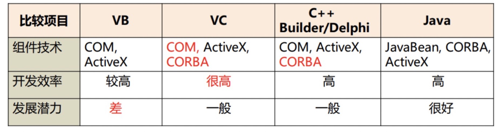
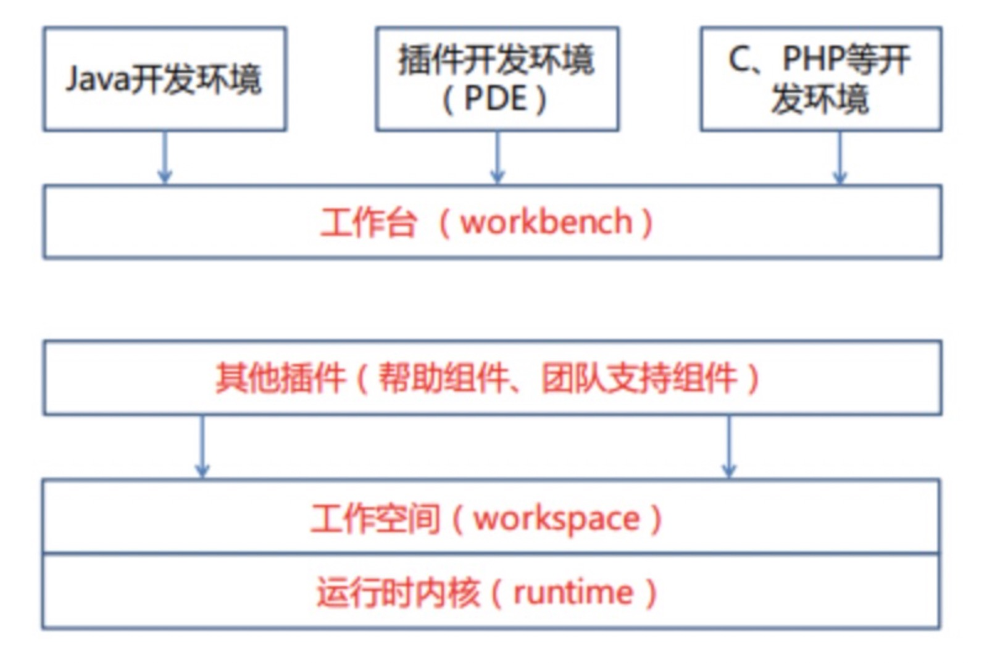
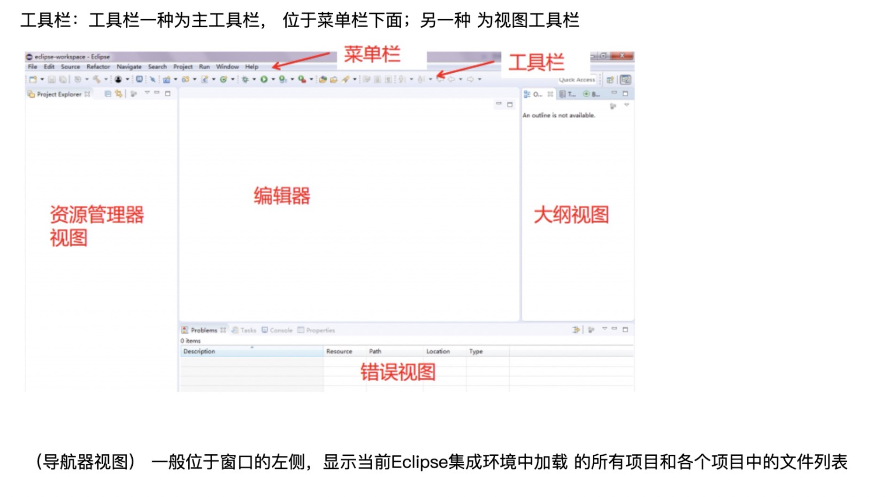
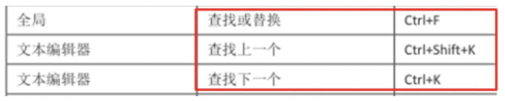
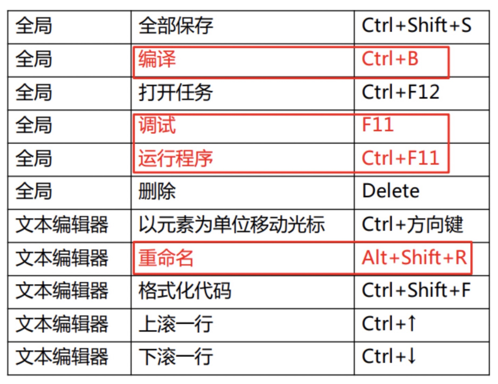
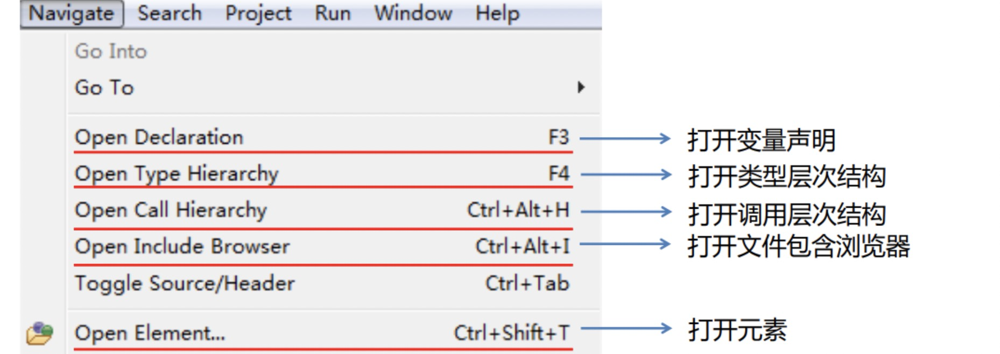

# 第一章 绪论

## 语言/软件的发展过程

- 机器语言（第一代语言）
  - 将表述逐条转换成机器指令
- 汇编语言（第二代语言）
  - 使用具有一定意义的单词(也叫做助记忆码或汇编码)来替代那些难以记忆, 无意义的, 二进制字符串
  - 用汇编码编写的程序叫做**汇编程序**
  - 把这些汇编指令逐条转为机器指令的程序称为**汇编系统**
  - **意义: 为改变通过逐条命令来指挥机器的状态, 只是减小了编程的困难**
- 高级程序设计语言（第三代语言）
  - 代表语言FORTRAN, ALGOL, COBOL等高级程序设计语言
  - 用尽可能接近自然语言的表达方式描述人们设想的处理过程, 将内容转换成机器指令的工作交给专门的工具**编译系统**
  - **意义: 实现了对机器的独立性, 不依赖特定的硬件系统, 大大提高了软件的可移植性**
- 非过程化语言（第四代语言，4GL）
  - 只要给机器下达做什么的指令, 由机器自己去安排执行的顺序

**人们开始对软件工作的认识大大深入, 在认识软件工作的重要性的同时, 也认识到了软件工作的困难性, 这就是所谓的"软件危机"问题**

## 开发工具的发展过程

1. 没有专用的软件开发工具阶段（20世纪70年代末-80年代初）
1. 利用通用软件作为辅助工具帮助开发人员编写文档或画图，可以减少很多工作量，但有很多工作是通用软件无法完成的。
2. 专用的软件开发工具阶段(20世界80年代) 
   1. 是面对某一工作阶段或某一工作任务的工具。 优点是能提高软件开发的质量和效率。 缺点是一致性的保持困难，对软件的开发缺乏全面的、统一的支撑环境
   2. 各种代码生成器
   3. 综合性的第四代语言
   4. 专用于编写某种文档的编写工具
   5. 数据字典管理系统
   6. 专用于画数据流程图, ER图或程序框图的绘图软件
3. 集成的软件开发环境阶段(1981年IBM宣布了一个AD/Cycle)的了理论框架, 看做进入集成软件开发环境阶段的标志
   1. 进入集成的软件开发环境阶段的标志是IBM在1989年提出的名为 AD/Cycle的巨大的理论框架。
4. 21世纪的软件开发新阶段
5. 有两个鲜明的特点： 第一是面向网络，不仅基于网络，而且用于网络。 第二是开源软件的兴起和运用。

## 不同阶段对软件开发工作的认识

把算法转成成机器指令, 交给硬件执行

使用汇编语言编写算法, 汇编程序将汇编指令转换成机器指令, 交给硬件执行

使用高级语言编写算法, 编译器将高级语言转换成机器指令, 交给硬件执行

用户提出需求, **对需求进行分析, 设计出对应的算法或产品, 使用高级语言开发**, 编译器将高级语言转换成机器指令, 交给硬件执行

## 软件开发工具工作的发展主要体现

1. 自动化程度高
   1. 离硬件越来越远, 与硬件的联系(内存安排, )由编译器, 链接程序完成
2. 将需求分析和架构设计加到了软件开发的工作中
   1. 从而使得软件开发过程向用户方面延伸, 离用户越来越近
3. 把软件开发工作延伸到项目及其版本管理
   1. 超出了一次编程的局限, 扩展到了作为一个不断发展和完成的过程
   2. 这是软件研制从个体的, 手工作坊的方式向科学的, 有组织的, 有计划的方式转变的重要表现
4. 吸取了许多科学的内容与方法
   1. 程序员的组织, 质量的控制

## 软件开发工具的概念

- 他是在高级程序设计语言之后, 软件技术进一步发展的产物
- 他的目的是在人们开发的过程中给予各种不同方面, 不同程度的支持和帮助
- 他支持软件开发的全过程规划, 分析, 测试, 文档和管理等阶段.

## 名词

### 第四代语言(4GL)

原义是: 非过程化的程序设计语言, 针对以处理过程为核心的第三代语言

希望通过某些标准处理过程的自动生成, 使得用户可以只说明要求做什么, 而把具体的执行步骤的安排交由软件自动处理.

第四代语言可以被看做软件开发工具的一类, 而不是全部.

### CASE工具

计算机辅助软件工程 Computer Aided Software Engineering

计算机辅助系统工程 Computer Aided System Engineering

### 可视化程序设计

### 最终用户计算

### 组件程序设计

## 软件开发工具的功能和性能

### 软件开发过程

- 需求分析
  - 从初始需求出发, 进行调查研究, 进行功能设计
- 总体设计
  - 包括整个软件的结构设计, 公用的数据文件或数据库的设计, 各部分的链接方式及信息交换标准
- 文档编制/代码设计
  - 程序和文件是两件并行的事情, 也将该阶段称为实现阶段
- 模块测试
  - 模块测试
- 总体测试
  - 整个软件联调
- 应用

### 软件开发工具的功能要求

我们把软件开发工具提供的各类支持归纳成以下5个主要方面

- 认识与描述客观系统
  - 需求分析阶段
  - 工作不确定性高
  - 更需要经验, 更难形式化, 规范化

- 存储及管理开发过程中的信息
  - 各阶段都要产生及使用许多信息
  - 项目规模大时, 这些信息量就会大大增加
  - 当项目持续时间长时, 信息的一致性就十分的重要

- 代码的编写或生成
  - 通过总结一般规律, 制作一定的框架或模板, 利用某些参数控制

- 文档的编写或生成
  - 难点是与程序保持一致性

- 软件项目管理
  - 为项目管理人员提供支持, 而不是程序员
  - 一般来说包括进度管理, 资源与费用管理, 质量管理三个基本内容
  - 对于软件项目来说, 两个比较特殊的问题
    - 测试工作方面的支持
    - 版本管理

### 软件开发工具的性能

所谓功能是指软件能做什么事

所谓性能则是事情能做到什么程度

1. 表达能力或描述能力
2. 保持信息一致的能力
3. 使用的方便程度
4. 工具的可靠度
5. 对硬件和软件环境的要求

## 开发工具的类别

### 按照工作阶段划分

- 计划工具
  - 完全为项目主管人员服务
- 分析工具
- 设计工具
  - 直接为软件开发过程中的编程,调试,文档编写工作提供帮助

### 按照集成度划分

- 专用工具
  - 面对某一工作阶段或一个一个工作任务的工具
- 集成化工具
  - 面向软件开发全过程的工具

### 按照硬件, 软件的关系划分

- 依赖于软硬件
- 独立于软硬件

## 软件开发工作的研究与应用

为什么学习软件开发工具

- 以便在实际工作中正确地选择与使用软件开发工具
- 在必要时能够参加或组织软件开发工具的自研
- 从而提高软件工作水平与效率的目标

## 复习题

1. 简要说明软件发展的几个主要阶段

2. 作为软件开发工作的新阶段, 21世纪的软件开发与以往有什么区别?

   1. 面向网络
   2. 开源软件的兴起和运用

3. 软件开发工具与第三代语言的关系是什么?

   1. 

4. 软件开发工具与第四代语言的关系是什么?

   1. 第四代语言（4GL）的原义是非过程化的程序设计语言。针对以处理过程为中心的第三代语言，

      第四代语言希望通过某些标准处理过程的自动生成，

      使得用户可以只说明要求做什么，而把具体的执行步骤的安排交由软件自动处理。

      显然，这一思路与软件开发工具是一致的，离硬件更远，离用户更近。

      但是，第四代语言没有涉及需求分析、项目管理、文档生成等问题。

      因此，我们认为第四代语言可以被看做软件开发工具中的一类，而不是全部。软件开发工具的范围还要更宽一些。

5. 软件开发工具的功能有哪些?

   1. 认识与描述客观系统
   2. 存储及管理开发过程中的信息
   3. 代码编写或生成
   4. 文档的编制与生成
   5. 软件项目的管理

6. 软件开发工具的主要性能指标有哪些?

   1. 表达能力或描述能力
   2. 保持信息一致性的能力
   3. 使用的方便程度
   4. 工具的可靠程度
   5. 对硬件和软件环境的要求

7. 从支持的工作阶段来看, 软件开发工具可以分为几类, 他的作用是什么?

   1. 计划工具
      1. 在实现阶段对人们提供帮助的工具
   2. 分析工具
      1. 直接为软甲开发过程中的编程,调试,文档编写工作提供帮助
   3. 设计工具
      1. 完全为项目管理主管人员服务

8. 什么叫做集成的软件开发工具?

   1. 

9. 软件开发工具与计算机硬件, 系统软件的关系如何?

10. 软件开发人员为什么需要学习和了解软件开发工具?

# 第二章 软件开发过程及其组织

## 软件开发过程中的两个转换过程

1. 用户对软件功能的理解与程序员对软件功能的理解之间的转化
2. 人和机器之间的交流与协调的问题

## 软件开发的困难

### 大型软件开发过程中的困难

1. 一致性的保持成为十分困难的问题
   1. 每个人对问题的理解, 工作习惯, 经验, 背景不同, 所以一致性很难加以控制
2. 测试的困难大大增加
   1. 每个程序员只了解自己这一部分, 无法全面预测自己的任何改动对其他部分的影响
3. 工作进度难以控制
   1. 单个程序员常常过低估计工作难度而拖延进度
4. 文档与代码的协调时分困难
   1. 程序调试时不断反复进行, 在某些时候文档是编程 程序的依据, 在某些时候, 有需要根据编程的情况撰写文档
   2. 随着编程的进展, 这些文档的内容总会有修改, 这时人们往往忘记修改文档, 从而使程序和文档不一致
5. 版本更新带来的困难

### 困难产生的原因

1. 这些困难来自于大系统的复杂性
2. 许多具有主动性的个人之间的组织与协调带来大量的困难
3. 各个应用领域之间的差别导致困难的加重
4. 时间的因素, 变化的因素给软件开发工作带来许多困难

## 软件开发方法的发展

面对大型软件开发过程中的困难, 仅从开发的方法而言, 先后提出了:

1. 结构化程序设计
2. 软件工程的基本思想方法
3. 面向对象的程序设计思想与方法
4. 即插即用程序设计思想与方法
5. 面向开源软件的程序设计

等程序设计方法

### 软件开发中各人员的责任

1. 用户
   1. 提出需求
   2. 验收软件
   3. 使用软件
   4. 提出修改要求
2. 项目负责人
   1. 分析需求
   2. 向程序员分配任务
   3. 验收模块
   4. 对整个项目进行联调
   5. 向用户交付使用
   6. 分析修改需求
3. 程序员
   1. 编写代码
   2. 编写文档
   3. 模块调试
   4. 向负责人交付自己的工作成果

### 结构化程序设计方法

#### 什么是结构化程序设计?

结构化程序思想是在20世纪60年代末期产生的

把程序的结构分解成三种基本的模块

1. 处理单元
2. 循环机制
3. 二分决策机制

#### 结构化程序设计的意义

合理的划分模块, 并保证模块结构良好的要求

#### 模块划分的三个基本要求

1. 模块的功能在逻辑上尽可能地单一化,明确化, 做好做到一一对应.
2. 模块之间的联系及互相影响尽可能地少, 对于必须的联系都应该加以明确的说明, 尽量避免逻辑的耦合, 而仅限于数据的耦合
3. 模块的规模应当足够小, 以便于使他本身的调试易于进行.

#### 实施结构化程序设计的基本思想

*一入一出，不GOTO 风格明确编文档。*

1. 限制甚至不用GOTO语句, 绝对禁止超越模块边界的GOTO语句
2. 子程序尽可能做到一个入口, 一个出口
3. 程序的风格应当尽量明确, 清洗, 适当增加注释, 变量名称要具有逻辑意义等
4. 在编写程序的同时完成有关文档的撰写, 不要拖延时间

### 软件工程方法

#### 软件工程思想是如何产生的

人们认识到, 把软件的质量寄托于各个程序员的技能与认真负责是不牢靠的, 危险的, 不现实的.

要想大幅度地, 从根本上提高软件开发的效率和质量, 就应当吸取人们在各种传统行业中的成功经验.

从组织管理的角度加强力量, 使软件生产从程序员的个人劳动成果提高成为有组织的, 可控的工程, 这就产生了软件工程.

#### 软件工程从传统产业工程中吸取了哪些经验？

1. 对工作步骤最初严格的规定, 工作顺序不能颠倒
2. 每个阶段都有各自明确的任务
3. 在质量, 表达方式等各个方面要有统一的, 被大家共同遵守的标准

### 面向对象的程序设计方法

*是人们试图解决软件危机的又一种尝试*

#### 面向对象的程序设计思想

1. 客观世界的任何事物都是对象, 他们有一些静态属性, 也有一些相关的操作, 作为一个整体, 对象对外不必公开的一些属性或方法就叫"封装性"
2. 对象之间有抽象与具体, 群体与个体, 整体与部分等几种关系
3. 抽象的, 较大的对象所具有的性质, 包括静态属性和动态操作, 自然地成为它的子类的性质, 不必加以说明或规定, 这就是所谓的遗传性.
4. 对象之间可以互送消息, 这个消息就是传送一个参数

*面向对象设计的语言：C++和smalltalk*

### 即插即用的程序设计方法

应用硬件制造思路来处理大型软件开发工作的方法。

一部分人专门生产软件组件，而另一部分人则构造整个软件的结构，并且把软件组件插入结构中，以便迅速地完成大型软件的研制工作。

提出即插即用程序设计的基础是面向对象程序设计。

### 面向开源软件的程序设计方法

在什么情况下利用开源软件进行程序设计比较合适?

在一些应用面广，流程比较清晰、比较规范的应用领域，开源代码的重用 是比较有把握的。

例如，网站的设计确实可以从开源代码中找到比较实用的，略加修改就可以使用的代码。这无疑是可以节省人力和物力的。

判断能否利用某开源软件的主要依据是对应用领域的充分了解

## 软件开发过程的管理

### 什么样的软件才是好的软件

1. 正确地实现所要求的功能
2. 用户界面友好
3. 具有足够的速度（而不是越快越好）
4. 具有足够的可靠性
5. 易于修改

### 如何成为一个好的程序员

1. 具有程序设计所需要的基本知识与技能
2. 对本项目所在的领域有较深的了解, 从而能够准确地理解用户的信息需求
3. 对于软件开发的技术环境比较熟悉, 包括硬件设备, 软件环境和网络环境

### 如何成为项目组的好成员

1. 保证严格地在本模块内操作
2. 严格按照总体设计的要求和理解去传递参数, 决不随意修改其内容或含义
3. 在对公用的文件或数据库进行存取时, 必须完全地, 准确地按照统一规定的格式去才操作
4. 在使用标识符时,  应按照统一的原则, 尽量使用易于看出的逻辑含义名称, 特别是涉及公用数据及参数时
5. 严格按照统一的要求编写文档, 在内容, 格式, 表达方式, 符号使用上遵循项目组的统一规定
6. 尽量保持程序风格一致.
7. 具有高度的纪律组织性和团队精神

### 怎样建立一个好的项目组

1. 有严格的, 成文的工作规范和文档标准
2. 人员之间有严格的分工, 除了程序员之外, 必须有专门的秘书负责文档的收集, 审核及保管
3. 每个项目都要事先指定详细的时间表, 并且得到严格的执行

## 复习题

1. 作为一个程序员, 软件开发的主要困难是什么?
2. 对于程序员来说, 提高软件开发的质量与效率应当从哪方面努力?
3. 大型软件的开发与单个程序员编写软件有什么本质的区别?
4. 几十年来, 人们为了提高软件开发的质量与效率提出了那些方法?
5. 结构化程序设计的基本思想与方法是什么?
6. 软件工程的基本思想与方法是什么?
7. 面向对象的程序设计的基本思想是什么?
8. 即插即用的程序设计思想是什么?
9. 面向开源软件的程序设计基本思想是什么?
10. 具有那些特点才称得上是一个好的软件?
11. 一个好的项目组应当具备那些基本条件?

# 第三章 软件开发工具的理论基础

## 软件开发过程中的信息需求

### 软件开发过程中的信息流通状况（重点、理解）

1. 有关系统环境、现状及需求的信息。由用户提出，由分析人员采集，需求分析。
2. 有关软件的功能设计与物理设计的各种信息。由分析人员设计方案。
3. 软件成果本身，包括程序与文档。由程序员编制。
4. 用户对系统的各种变更要求，以及系统的各种变更的记录。由维护人员收集。

## 概念模式及其作用

### 什么是概念模式

人们在认识事物过程中, 对某一事物或某一系统形成的, 抽象的, 一般化的框架

### 概念模式的作用

概念模式在认识中的作用十分重要, 同时作为交流与表达工具也十分重要, 人们在互相配合,相互协调, 共同完成某项任务时, 需要统一思想, 统一认识, 协同行动就必须用某种公认的方式进行表述.

### 概念模式包括的内容

1. 对软件的应用环境的认识和理解
2. 对预期生产的软件产品的认识和理解
3. 对软件开发过程的认识和理解

### 常用的概念模式

1. 框图(Flow Chart)
2. 结构图(Structure Chart)
3. 数据流程图(Data Flow Diagram)
4. 实体关系图(Entity-Relationship Diagram)实体, 关系, 属性三个基本概念
5. 数据字典(Data Dictionary)
6. 时序图(Petri Net)
7. 数学与逻辑模型
8. 计算机模拟模型

## 信息库及其一致性

信息库就是一个包罗万象, 随着项目进度不断修改与补充的数据集合

#### 信息库的研究方面

1. 软件的工作环境, 功能需求, 性能要求, 有关各种信息来源的状况, 用户的状况, 硬件环境以及在该专业领域中的作用等外部信息
2. 需求分析阶段中收集的有关用户的各种信息, 包括用户本身提供的, 也包括在调查研究中的得到
3. 逻辑设计阶段的各种调查材料由此生成各种文档, 包括调查记录, 原始数据, 报表及单证的样本, 绘制的各种图以及最后生成的系统说明书
4. 设计阶段的各种资料, 包括所有的数据库与数据文件格式, 数据字典, 程序模块的要求, 总体结构, 各种接口及参数的传递方式以及最后形成的设计方案
5. 编程阶段所有的的成果, 包括程序代码, 框图, 变量说明, 测试情况, 验收报告, 使用说明等.
6. 运行及使用情况的详细记录, 包括每次使用的时间, 状态, 问题, 特别是有关错误及故障的记录情况
7. 维护及修改的情况, 包括修改的目标, 责任人, 过程, 时间, 修改前后的代码与文档以及修改后的结果, 原系统的备份
8. 项目管理的有关信息, 人员变更, 资金投入, 进度计划及实施情况

## 人机界面机器管理

1. 用户界面的主要功能是通信
2. 用户界面必须始终一致
3. 用户界面必须使用户随时掌握任务的进行情况
4. 用户界面必须提供帮助
5. 宁可让程序多干, 不可让用户多干

### 人机交互的手段

1. 键盘操作
2. 屏幕滚动
3. 菜单选择
4. 帮助系统
5. 鼠标操作
6. 色彩应用
7. 数据录入
8. 信息显示

## 项目管理与版本管理

### 项目管理的特点

1. 子任务多, 关系复杂
2. 任务不可重复, 形式不断变更, 项目管理的核心要素是质量
3. 协调组织的任务十分突出
4. 信息处理工作的作用于意义更为突出

### 项目管理的基本目标

1. 是产品的质量得到有效的控制
2. 保证整个系统按预定的进度完成
3. 有效利用各种资源, 尽可能使资源的闲置与浪费减少.
4. 控制与降低成本

## 复习题

1. 软件开发过程中需要哪些信息与信息处理方面的帮助与支持
2. 软件开发工具的理论基础包括哪些方面
3. 什么叫做概念模式, 说明他的作用与使用方法
4. 什么叫做信息库, 他与数据库, 数据仓库有什么区别
5. 为什么信息库的一致性十分重要
6. 人机界面设计的原则是什么, 结合自己的体会谈其中的两条
7. 人机界面的常用技术手段有哪些
8. 什么叫做项目管理, 其任务是什么
9. 什么叫做版本管理, 其任务是什么

# 第四章 软件开发工具的技术要素

## 软件开发工具的一般功能

1. 提供描述软件状况及其开发过程中的概念模式, 以协助软件开发人员认识软件工作的环境与要求, 合理地组织与管理软件开发的工作过程
2. 提供存储和管理有关信息的机制和手段
3. 帮助使用者编制, 生产及修改各种文档
4. 帮助使用者编写程序代码
5. 对历史信息进行跨生命周期的管理

## 软件开发工具的一般结构

1. 中心位置的是总控和人机界面, 他们是使用者和软件开发工具之间交流信息的桥梁
2. 信息库内容的丰富程序是软件开发工具的功能与作用的最基本的依据

## 总控与人机界面

软件开发工具技术3个要点

1. 面向使用者
2. 保证信息的准确传递
3. 保证系统的开发性或灵活性

## AD/Cycle软件开发周期

1. 需求分析阶段
   1. 建立逻辑模型
2. 分析阶段
   1. 完成系统的总体设计, 包括数据结构的详细设计, 处理过程的详细设计, 子系统或模块之间的划分
3. 编码阶段
   1. 具体的编写软件的阶段, 这里是实际的程序代码的产生点.
4. 测试阶段
   1. 对已完成的各个模块或子系统进行测试, 调整,  以便最终形成完整的软件
5. 维护阶段
   1. 组织管理软件的日程运行, 收集运行中的状态信息及出现的问题, 并且及时地进行局部的修改和完善

## 信息库及其管理

*信息库是软件开发工具的基础*

### 信息库内容

1. 关于软件应用的领域和环境的状况
   1. 软件要处理的信息的种类, 格式, 数量, 流向, 应用领域对软件的要求, 使用者的情况, 背景, 工作目标, 工作习惯
2. 设计成果, 包括逻辑设计和物理设计, 这类信息是分析人员利用前一类信息, 通过人机交互的方式形成的设计方案
   1. 数据流程图, 数据字典, 系统结构图, 数据库的逻辑设计, 各种模块的设计要求
3. 运行状况的记录, 投入运行后, 对他的运行情况进行详细的记录
   1. 运行效率, 作用, 用户反映, 故障情况, 故障的原因, 处理的情况, 修改记录
4. 有关项目管理和版本管理的信息, 这属于跨生命周期的信息
   1. 项目进度, 过程, 人员分工, 资源投入, 版本组织

### 信息库的组织方式

| 组织方式                            | 优点                                                         | 缺点                                                       |
| ----------------------------------- | ------------------------------------------------------------ | ---------------------------------------------------------- |
| 集中式存储                          | 充分利用已有的数据库技术, 较容易保持一致性                   | 与模块的要求冲突                                           |
| 分散式存储                          | 易于变更和裁剪,一旦某部分发生变更,不影响整个系统             | 每个模块都要自己有一套更删改查操作, 数据一致性无法得到保证 |
| 逻辑上统一,物理上分散(信息管理模块) | 通过信息管理模块对分散的数据库进行存取,并进行一致性和检查维护, 使数据与模块都实现了模块化, 保持了一致性和灵活性 |                                                            |

### 信息库的管理功能

1. 和一般数据库管理系统一样的
   1. 录入更新
   2. 使用查询
   3. 一致性维护
2. 和一般数据库管理系统不一样的
   1. 信息之间逻辑联系的识别与记录
      1. 大概就是需要联动起来, 改了A, B和他有联系, 也要被动修改
   2. 如何实现定量信息与文字信息的协调一致性
      1. 定量好比常量, 在文档中多处地方使用了这个定量信息, 当该信息修改时, 那些引用的地方怎么修改呢

### 历史信息的处理方法

两个具体的困难

1. 历史信息的数量太大, 占用的存储设备过多
   1. 一般采用脱机备份的方式解决, 存储设备越来越便宜
2. 历史信息格式不一致, 难以有效地利用
   1. 加强标准化, 稳定数据结构会使问题得到一定程度的解决
   2. 使用一些智能的方法, 是的跨生命周期的信息得以互相转换, 实现重用与共享, 关于这个问题, 至今没有十分满意的解决办法

## 文档生成与代码生成

### 代码生成

代码生成器的基本任务是根据设计的要求, 自动的或者半自动的产生相应的某种语言的程序

输出程序代码是代码生成模块的目标

### 文档生成

### 项目管理与版本管理

项目管理应当考虑的范围

1. 研究与确定开发工作的方针和方法
   1. 采用什么样的阶段划分方法, 采用什么样的系统描述方法
2. 开发任务的划分与分工
   1. 整个开发任务如何分解成具体的任务, 这些任务应该让那些人来做, 这些任务之间的关系
3. 资源状况
   1. 有多少人力, 物力, 设备, 软件, 资金, 他们都在做什么, 是否得到充分利用, 是否需要增加
4. 人员状况
   1. 每个人的进度如何, 技术水平如何
5. 变更情况
   1. 需求有什么变更, 环境有什么变更, 人员有什么编程
6. 质量情况
   1. 检验的标准是什么, 如何检验, 由谁来检验, 用什么数据来检验

### 复习题

1. 软件开发工具的基本功能有哪些
2. 一体机的软件开发工具包括那几个主要组成部分
3. 总控的人机界面为什么是系统开放性和灵活性的关键
4. 总控和人机界面的设计原则是什么
5. 信息库的内容包括哪几个方面
6. 信息库的结构方式有那几种, 为什么要有专门的信息库管理模块
7. 代码生成的输出形式有哪几种, 各有什么特点
8. 代码生成器依据那些资料工作
9. 项目管理的任务包括那些方面
10. 项目管理工作的困难何在

# 第五章 软件开发工具的使用与开发

## 购置与开发的权衡

购买市场上已有的产品

- 优点
  - 能够帮助人们减轻一定的工作负担, 在某些环节上代替一些简单的、重复性的工作。
  - 当项目比较大，时间持续比较长的情况下，使用工具还可以使工作的组织管理比较规范，信息的管理与检索比较方便，部分地做到信息与知识的重用和共享。
- 缺点
  - 价格昂贵
  - 未经过真正的考验, 可信和可靠程度不尽人意

自己开发

- 优点
  - 目标明确, 切实符合自己的需求
  - 便于进一步扩充和升级，不存在引进外面产品时不可避免的冲突与不一致。
  - 可以商品化，成为软件产品出售。

*从长远来看, 自行开发工具的情况会越来越少*

购买现成的软件开发工具还是自己开发专用的工具，与具体工作的**条件、 环境、人员素质、项目特征**都有不可分割的联系

**软件开发工具的运行环境**

- 硬件配置：内存规模 、磁盘容量、 主机速度 、输入输出设备
- 系统软件
- 数据库管理系统
- 网络通信

## 软件开发工具的选择与购置

如何在五花八门的软件开发工具中进行合理的选择

1. 明确目的与要求
   1. 为那个软件开发项目而使用的工具
   2. 是在哪个阶段使用工具
   3. 工具将供那些人使用
   4. 工具将在怎样的软件和硬件环境下使用
2. 调查市场
   1. 软件开发工具的性能
   2. 软件开发工具的性能
   3. 软件开发工具所使用或依据的开放方法或开发理论是什么
   4. 软件开发工具的运行环境是什么
   5. 软件开发工具的文档资料是否齐全
   6. 软件开发工具的服务, 培训条件如何
   7. 价格
3. 软件开发工具的购置方法与步骤
   1. 明确购买软件开发工具的目的和需求
   2. 明确购买软件开发工具的环境条件和制约条件
   3. 市场调查
   4. 对于可供选择的各种工具进行综合比较
   5. 进行测试和检验
   6. 正式签署购置
   7. 安装与使用

## 软件开发工具的使用

引入软件开发工具之后, 组织管理工作包括哪些

1. 严格使用制度
2. 记录使用的详细过程
3. 培训使用人员
4. 经常进行审计与评价工作

## 软件开发工具的开发

自行开发软件开发工具的原则

1. 从实际出发, 设定现实的, 有限的目标
2. 坚持短小使用, 逐步积累, 避免期望过高, 贪大求全
3. 注意文档的齐全与资料的累积

## 复习题

1. 怎样考虑购置软件开发工具以及自行研制工具的权衡, 那些因素是必须认证考虑的
2. 为什么软件开发工具选用之前必须设定明确的, 有点的目标
3. 软件开发工具的时长调查应该包括哪些内容
4. 软件开发工具得到有效的使用吗, 并发挥真正的作用, 需要哪些条件
5. 引入软件开发工具后, 应当怎么管理
6. 在对软件开发工具的使用情况进行审计时, 需要考虑哪些问题
7. 为自己所使用的工具或商业化的软件开发工具有什么区别
8. 结合自己所了解的软件开发工具, 分析现阶段软件开发工具的实际发展水平, 以及使用者应当采取的策略

# 第六章 软件开发工具的现状与发展

## 软件开发工具的发展现状

### 国外发展状况

1. 20世纪80年代中期, 专项的, 支持某一工作环节的专用工具大量涌现, 很快人们发现这种分散应用的弱点, 提出了一体化的要求

### 国内发展状况

## 软件开发工具的发展方向与趋势

### 几个值得注意的发展方向

1. 智能化
   1. 应用人工智能, 神经网络等技术
2. 网络化
   1. 通过网络人们可以更方便的互通信息, 共享知识
3. 一体化
   1. 只有对于软件开发中涉及的各种信息，以及在开发过程中它们的发生、 变化、关系、一致性等有了完整与深刻的理解，才能真正实现软件开发工具的一体化
4. 标准化
   1. 软件构件必须实现标准化，用构件组成大型软件的结构也必须符合 一定的标准，否则就不可能提高生产效率。

### 软件工具的发展轨迹

2008年，国际电子电气工程师学会的权威刊物《软件》指出——

### 从计算机语言发展而来的工具

### 综合性的平台或开发环境

- Visual Studio在微软环境下和其他产品的交互协同能够 浑然一体，天衣无缝； 开发使用容易； 产品间的差别透明度高； 在运行速度，代码显示速度等方面也强于Eclipse。
- Eclipse 是一款免费的、面向各平台开发者的软件开发环境，在各种操作系统上表现差异 非常小。 Eclipse 具有“大平台，小核心，多插件”的特点，更富有灵活性。

# 第七章 eclipse入门

eclipse是一个开放源代码, 基于java的可扩展集成应用程序开发环境

eclipse的体系架构

- 运行时内核
  - 平台运行库是内核, 他在启动时检查安装了那些插件, 并创建关于他们的注册信息
- 工作空间
  - 工作空间是负责管理用户资源的插件, 包括用户创建的项目, 项目中的文件, 以及文件变更和其他资源
- 工作台
  - 工作台为eclipse提供用户界面
- 其他插件
  - 帮助组件, 团队支持组件等

## eclipse的获取与安装

- 使用Eclipse，首先需要安装JDK（Java SE Development Kit）。
- 安装JDK之后，开始安装专门用于编写C和C++程序的Eclipse开发环 境CDT（C/C++ Development Tools），本课程使用的是3.5.0版本。

# 第八章 eclipse工作台

Eclipse 工作台（Workbench）是一个高级用户界面框架，它为用 户提供了一个整体结构和可扩展的用户界面。

## 工作空间

工作空间是eclipse在用户计算机硬盘上划出的一块区域,用来存放用户的, 代码, 配置信息等

### Eclipse工作台的组成部分

Eclipse工作台是一个高级用 户界面框架，它为用户提供 了一个整体架构和可扩展的用户界面。

### Eclipse工作台包括

菜单栏、工具栏、透视图。 透视图又分为视图和编辑器。

## 透视图及试图介绍

- 视图：导航器视图（资源管理器视图） 、大纲视图 、控制台视图
- 编辑器：中间编写代码或者文件的地方

### 主要视图

- 导航器视图（资源管理器）：显示当前集成环境中加载的所有项目和各个项目的文件列表
- 大纲视图：显示当前活动编辑器中所打开文件的纲要，如函数、变量等。
- 错误视图：编写代码时，错误视图会实时显示程序中的错误，提示用户及时改正。 另外，错误视图中也显示相关警告信息。
- 搜索视图：显示搜索结果的详细信息。
- 任务视图：用于显示程序代码中未完成的任务
- 控制台视图：程序的输入输出在该视图中完成

## 编辑器介绍

**编辑器：**编辑器是工作台中的一个可视化组件，编辑器允许用户打开、编辑、 查看、保存文档对象。在Eclipse中，所有视图共享同一组编辑器。

**常用的编辑器有哪些（记忆）**

- C/C++编辑器
- Web浏览器（用于打开网页文件）
- 文本编辑器
- 任务编辑器
- 二进制文件编辑器

## 管理项目

Eclipse集成开发环境中，每个小程序都是以项目（Project） 为单位存在的。

**新建项目的步骤（记忆）**

文件（File）→新建（New） →项目（Project）

**从外部导入项目（记忆）**

文件（File）→导入（Import）

## 常用快捷键

## 使用eclipse帮助文档

- 使用联机帮助文档 帮助（Help）→帮助内容（Help Contents）

- 使用动态帮助 单击特定部分（如大纲视图） →单击菜单栏帮 助（Help） →动态帮助（Dynamic Help）

# 第九章 使用eclipse进行C/C++开发

### **一、安装MinGW**

MinGW是指用来生成可执行文件的编译环境，它是开发C/C++项目 的工具集。为了能够使用Eclipse CDT编译且运行C和C++程序，必须 要安装一个C／C++编译器。

下载：https://sourceforge.net/

### 二、第一个C/C++项目

C语言是一种面向过程的计算机程序设计语言。它既具有高级语言 的特点，又具有汇编语言的特点。它是目前众多计算机语言中公认 的优秀的结构程序设计语言之一

**新建c项目：**

文件（File）→新建（New） →项目（Project） →C Project ；在C Project 窗口中选择C语言相关 属性。在项目名称（Project name） 标签中输入项目名称。

在Basic Settings窗口中可以设 置源代码的注释部分内容。分 别在作者（Author）、版权声 明（Copyright notice）等标 签中输入相应内容，点击next 按钮。

在Select Configurations窗口 中可以选择调试和发布文件夹 以及高级设定，保持默认设置 后单击Finish按钮即可新建C Project，在这个项目中将会保 存编写的源代码文件和配置文 件。

**新建Source Folder（重点、记忆、应用）**

鼠标右击资源浏览器中新建的项目→选择新建（New）子菜单里的源 文件夹（Source Folder） 选项

输入文件夹名称，把光标定位到文件名（Folder name）中输入源 文件夹名称（一般为src） → Finish

**新建C++Class（重点、记忆、应用）**

鼠标右击src文件夹→选择新建（New）子菜单里的类（Class）选项 →输入类名称 → Finish

完成后，Eclipse CDT会自动生成HelloWorld程序，这是一个.c文件， 接下来要将它编译为可以运行的.exe文件。

**编译C程序（重点、记忆、应用）**

鼠标右击新建项目→Build Configurations→Build→ All

编译成功后会在资源管理器中看到Release文件夹， 包含刚刚被编译的可执行文件。

**运行C程序（重点、记忆、应用）**

在资源管理器中鼠标右击新建项目→在运行方式（Run As）子菜单 中选择运行设置（Run Configurations）

在Create,manage,and run configurations窗口中，单击新建运 行配置（New launch configuration）按钮新建一个运行配置。

进入新建窗口后，在Build configuration选项中选择Release，单 击Search Project按钮进行设置。全部设置完毕后，点击Run。

**使用浏览功能（重点、记忆、应用）**

Eclipse为C/C++程序员提供了一系列工具以方便程序开发。其中， 使用浏览功能可以从多个角度快速查看并定位到程序中的各个元素， 包括代码的层次结构、调用关系、继承关系等。

 

 

Eclipse中将命名空间、类、结构、变量等定义为（ 元素 ）。

 

### 三、使用Eclipse重构功能

使用Eclipse重构功能，用户可以在不影响程序运行的情况下进行 系统范围内的代码更改。

**重命名变量（记忆、应用）**

Eclipse重构中的重命名功能解决了变量、类、函数等重命名的所有问 题。

选中变量→单击菜单栏中的重构（Refactor）→选中重命名 （Rename）→ 填写新的变量名称→OK按钮

**抽取方法（记忆、应用）**

将程序中出现多次的代码段抽取出来形成方法，可以大大减少代码的 长度并增加程序可读性和易维护性，同时使得方法的调用变得清晰和 简单。

选中代码段，鼠标右击选中部分→在弹出的菜单中选择重构 （Refactor）子菜单下的抽取方法（Extract Function）→在弹出的 窗口中输入方法名→Next按钮

**抽取常量（记忆、应用）**

抽取常量本质上是将程序中的数字、字符等定义为常量，使得对于常 量的调用和修改变得简单。

选中常量，鼠标右击选中部分→在弹出的菜单中选择重构（Refactor） 子菜单下的抽取常量（Extract Constant）→在打开窗口的文本框中 输入常量名→Next按钮

### 四、使用搜索功能

**使用查找/替换方法（记忆、应用）**

编辑（Edit）→查找/替换（Find/Replace）

**使用Search菜单进行搜索（记忆、应用）**

在Eclipse CDT 特有的Search 功能中，可以执行文件、任务 和C／C++搜索功能。 Search 菜单→ Search选项

# 第十章 调试程序

